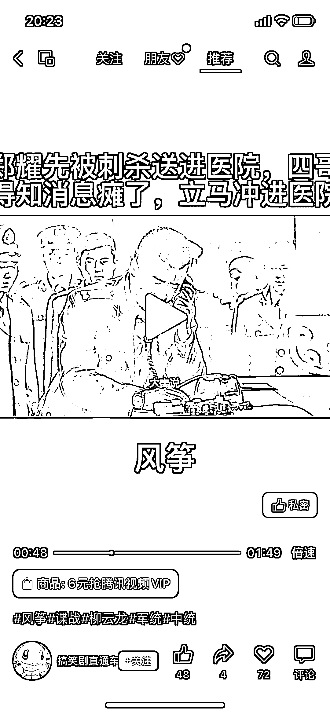
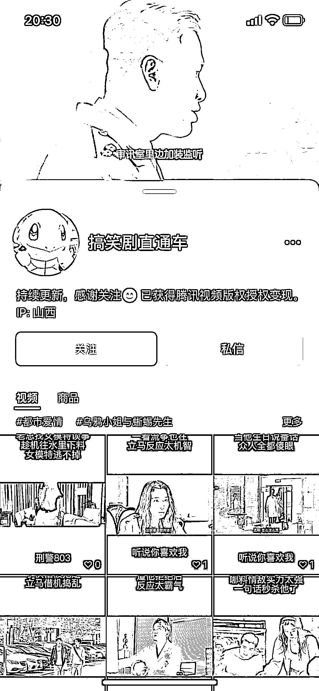
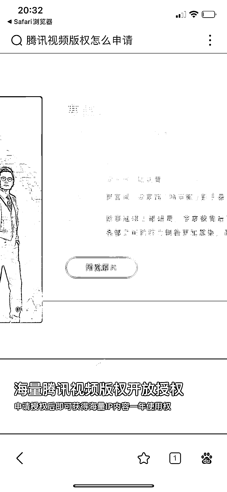

# 视频号可以推腾讯视频 CPS

> 原文：[`www.yuque.com/for_lazy/xkrm14/ghtsuoavdmlkax83`](https://www.yuque.com/for_lazy/xkrm14/ghtsuoavdmlkax83)

作者： 萤火虫

日期：2023-02-16

点赞数：40

<ne-hole id="uf5928f03" data-lake-id="uf5928f03">

正文：

这个应该能中标[呲牙] 图一图二：我刷视频号发现的视频可以挂腾讯视频的开通链接，我感觉想 Cps 图三:我又一次刷到他，看到了他的签名，然后去搜 图四：可以在腾讯视频里获取视频授权 最后我去腾讯视频官网上找到了具体的位置：点击创作者中心：版权授权。 这个挂会员的方法我也找到了：创作者中心等级权益 千粉权益。 这个风向标我感觉可以演变成和小说推文同类的项目，知乎推文团队注意了[偷笑]

  <ne-p id="u4a3ba716" data-lake-id="u4a3ba716">

<ne-hole id="ubbe0e00d" data-lake-id="ubbe0e00d">

评论区：

徐 Ken : 短剧 CPS?

萤火虫 : 萤火虫 回复 徐 Ken: 不是，这个不是短剧，是剪辑腾讯视频的影视片段，同时可以卖视频会员，并且有版权授权

<ne-hole id="u2d7f66c0" data-lake-id="u2d7f66c0">

公众号懒人找资源，懒人专属群分享

</ne-hole></ne-hole></ne-p></ne-hole>