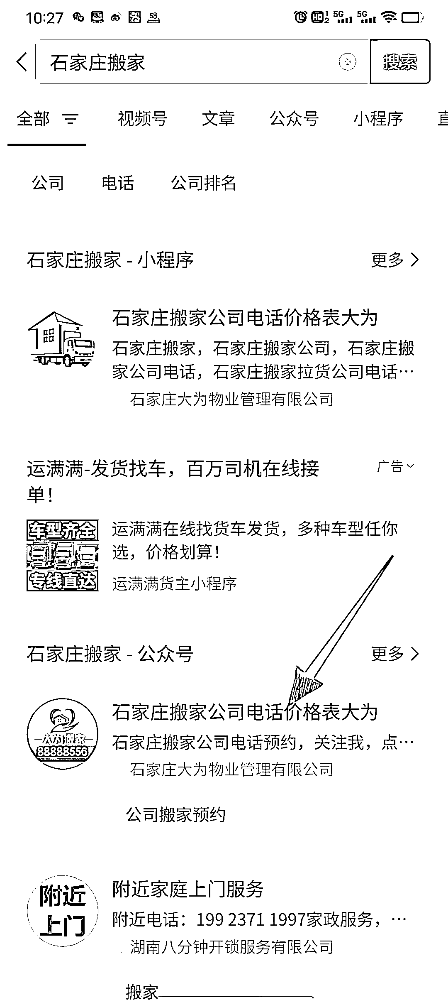

# 优化搜一搜公众号排名

> 原文：[`www.yuque.com/for_lazy/xkrm14/qbe3ehdczio22b6t`](https://www.yuque.com/for_lazy/xkrm14/qbe3ehdczio22b6t)

<ne-p id="ue279f759" data-lake-id="ue279f759"><ne-text id="uc467ddff">作者： 一把菜刀【搜索引流】</ne-text></ne-p> <ne-p id="u060726ba" data-lake-id="u060726ba"><ne-text id="u3eb1a84d">日期：2023-02-15</ne-text></ne-p> <ne-p id="ucb9fbcff" data-lake-id="ucb9fbcff"><ne-text id="ue714c617">点赞数：</ne-text><ne-text id="u401857d2" ne-bold="true">8</ne-text></ne-p> <ne-hole id="ua15ebc82" data-lake-id="ua15ebc82"><ne-card data-card-name="hr" data-card-type="block" id="tX478" data-event-boundary="card"><ne-p id="u9b679a2e" data-lake-id="u9b679a2e"><ne-text id="u628e8e64">正文：</ne-text></ne-p> <ne-p id="u37c4459f" data-lake-id="u37c4459f"><ne-text id="uc8ee0c16">年初不少财友咨询到我，带搜一搜服务的公众号能优化吗？答案是可以的，跟公众号 seo 优化排名类似。案例自己看图。</ne-text></ne-p> <ne-p id="ud38cab6c" data-lake-id="ud38cab6c"><ne-card data-card-name="image" data-card-type="inline" id="aVyG0" data-event-boundary="card"></ne-card></ne-p> <ne-p id="u36e64f7d" data-lake-id="u36e64f7d"><ne-card data-card-name="image" data-card-type="inline" id="whR4q" data-event-boundary="card"></ne-card></ne-p> <ne-hole id="u8b16c81f" data-lake-id="u8b16c81f"><ne-card data-card-name="hr" data-card-type="block" id="tg5K3" data-event-boundary="card"><ne-p id="uf50c9553" data-lake-id="uf50c9553"><ne-text id="ub786e0ad">评论区：</ne-text></ne-p> <ne-p id="u5602b647" data-lake-id="u5602b647"><ne-text id="u94d363c5">暂无评论</ne-text></ne-p> <ne-hole id="u08bef822" data-lake-id="u08bef822"><ne-card data-card-name="hr" data-card-type="block" id="cMBgY" data-event-boundary="card"><ne-p id="u0afd1de1" data-lake-id="u0afd1de1"><ne-text id="ubd5eb54a">公众号懒人找资源，懒人专属群分享</ne-text></ne-p></ne-card></ne-hole></ne-card></ne-hole></ne-card></ne-hole>