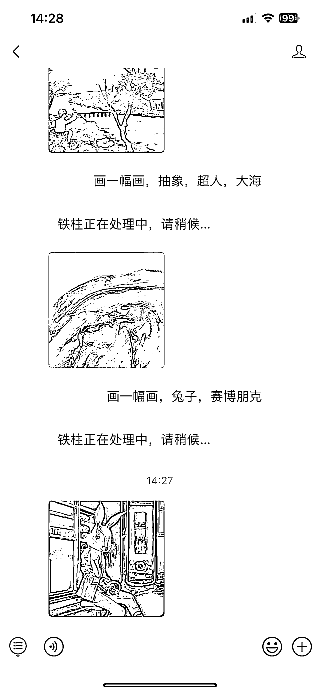

# AI 绘画功能应用在公众号

> 原文：[`www.yuque.com/for_lazy/xkrm14/ngn9mignlv6d3fob`](https://www.yuque.com/for_lazy/xkrm14/ngn9mignlv6d3fob)

<ne-p id="uc29b761d" data-lake-id="uc29b761d"><ne-text id="ubd22ee3e">作者： 🍀刘驴💥</ne-text></ne-p> <ne-p id="ua2b92458" data-lake-id="ua2b92458"><ne-text id="u6499ad6f">日期：2023-02-13</ne-text></ne-p> <ne-p id="uc1a51310" data-lake-id="uc1a51310"><ne-text id="u734addd6">点赞数：</ne-text><ne-text id="u9f862176" ne-bold="true">23</ne-text></ne-p> <ne-hole id="u6b694868" data-lake-id="u6b694868"><ne-card data-card-name="hr" data-card-type="block" id="gBrvB" data-event-boundary="card"><ne-p id="u07344fa4" data-lake-id="u07344fa4"><ne-text id="udabbbf44">正文：</ne-text></ne-p> <ne-p id="ubb1aadd1" data-lake-id="ubb1aadd1"><ne-text id="u5047ccd9">随着 chatgpt 爆火，我看见很多人也更加关注 ai 落地应用这一方面，这个公号就很有意思，把 AI</ne-text> <ne-text id="u5dc672ba">绘画功能应用在自己的公号里，如果是我，我可能还会再加上裂变玩法，可以快速把公号粉丝做上去</ne-text></ne-p> <ne-p id="uc20cb897" data-lake-id="uc20cb897"><ne-card data-card-name="image" data-card-type="inline" id="UWTLX" data-event-boundary="card">  <ne-hole id="ua11d45e0" data-lake-id="ua11d45e0"><ne-card data-card-name="hr" data-card-type="block" id="RDrV4" data-event-boundary="card"><ne-p id="ubb1b1398" data-lake-id="ubb1b1398"><ne-text id="u57a295f7">评论区：</ne-text></ne-p> <ne-hole id="u4c47c9c0" data-lake-id="u4c47c9c0"><ne-card data-card-name="hr" data-card-type="block" id="uHo7h" data-event-boundary="card"><ne-p id="u335b6c06" data-lake-id="u335b6c06"><ne-text id="u7d7e7993">公众号懒人找资源，懒人专属群分享</ne-text></ne-p></ne-card></ne-hole></ne-card></ne-hole></ne-card></ne-p></ne-card></ne-hole>