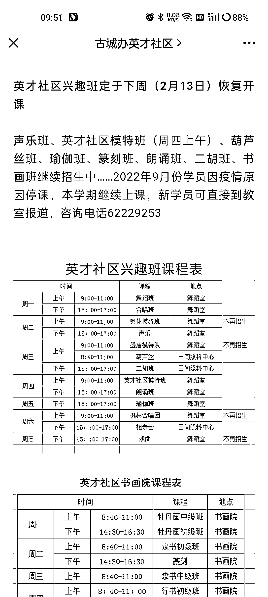

# 以社区为单位的，开设老年人兴趣培训班

> 原文：[`www.yuque.com/for_lazy/xkrm14/muae3rbrt03pyrde`](https://www.yuque.com/for_lazy/xkrm14/muae3rbrt03pyrde)

作者： 秋冬。

日期：2023-02-13

点赞数：16

<ne-hole id="udcb589a5" data-lake-id="udcb589a5"><ne-card data-card-name="hr" data-card-type="block" id="CUP5t" data-event-boundary="card">

正文：

以社区为单位的，老年人兴趣培训班开始兴起。证明老年兴趣培训的蓝海市场，有资源整合能力，或者兴趣教培行业经验的可以开始涉足。 白天针对于送完孩子的中老年人开设兴趣培训班，晚上跟周末针对于小朋友开设的兴趣培训班。 同一个教室，充分利用各个时间阶段，也为中老年人提供娱乐，交流的场所！

<ne-card data-card-name="image" data-card-type="inline" id="LVgmU" data-event-boundary="card">  <ne-p id="uf78d2c3d" data-lake-id="uf78d2c3d"><ne-card data-card-name="image" data-card-type="inline" id="wJs6L" data-event-boundary="card">  <ne-hole id="u0ac9c5c4" data-lake-id="u0ac9c5c4"><ne-card data-card-name="hr" data-card-type="block" id="WsgL9" data-event-boundary="card"><ne-p id="u0d32d9df" data-lake-id="u0d32d9df">评论区：

<ne-hole id="u0d24fc34" data-lake-id="u0d24fc34"><ne-card data-card-name="hr" data-card-type="block" id="N6hhY" data-event-boundary="card">

公众号懒人找资源，懒人专属群分享

</ne-card></ne-hole></ne-card></ne-hole></ne-card></ne-p></ne-card></ne-p></ne-card></ne-hole>