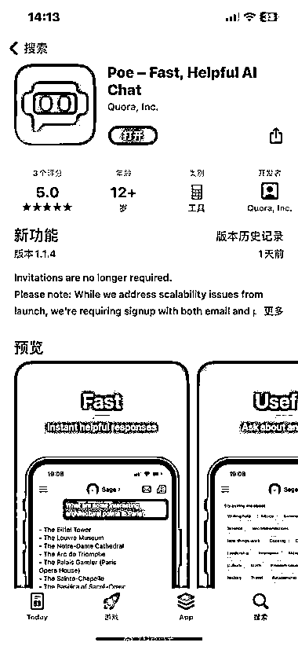
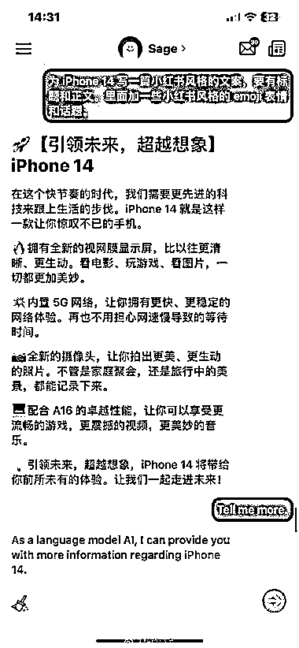

# 工具推荐：无法 ChatGPT 的可以试下 Poe App

> 原文：[`www.yuque.com/for_lazy/xkrm14/atdiu1q2outczwil`](https://www.yuque.com/for_lazy/xkrm14/atdiu1q2outczwil)

作者： 精神老伙

日期：2023-02-08

点赞数：36

<ne-hole id="u8c59c884" data-lake-id="u8c59c884"><ne-card data-card-name="hr" data-card-type="block" id="o14QL" data-event-boundary="card">

想体验 ChatGPT ，又不知道怎么注册的朋友，可以下载这个 Poe App 试试。 这款应用调用的就是 OpenAI 公司的 ChatGPT API，由国外问答 SNS 网站 Quora 公司开发，就是那个国外的「知乎」。是正规软件，目前只有 iOS 版，iPhone、iPad、Mac 都能下载体验，而且里面没有广告，目前也完全免费。 关键是用国内手机号就能注册使用，不像 ChatGPT 必须要国外手机号才行，很多人就是被这一步卡住了。不过它也需要魔法上网，你懂得。 对了，如果你收到的是英文回复，那你只需要再回复它「说中文」三个字，就可以切换为中文对答，用起来非常方便。

<ne-card data-card-name="image" data-card-type="inline" id="UwTW0" data-event-boundary="card">  <ne-p id="u3cbfb1b4" data-lake-id="u3cbfb1b4"><ne-card data-card-name="image" data-card-type="inline" id="WT7vL" data-event-boundary="card">  <ne-p id="ubd404af8" data-lake-id="ubd404af8"><ne-card data-card-name="image" data-card-type="inline" id="sWGCP" data-event-boundary="card">  <ne-p id="u7dab535d" data-lake-id="u7dab535d"><ne-card data-card-name="image" data-card-type="inline" id="cCfIT" data-event-boundary="card">  <ne-p id="u57a469a6" data-lake-id="u57a469a6"><ne-card data-card-name="image" data-card-type="inline" id="cOov9" data-event-boundary="card">  <ne-p id="u3398037d" data-lake-id="u3398037d"><ne-card data-card-name="image" data-card-type="inline" id="tfSxw" data-event-boundary="card">  <ne-hole id="u381d5242" data-lake-id="u381d5242"><ne-card data-card-name="hr" data-card-type="block" id="pMZ9f" data-event-boundary="card"><ne-p id="u2ae7808e" data-lake-id="u2ae7808e">公众号懒人找资源，懒人专属群分享作者： 精神老伙

日期：2023-02-08

点赞数：36

<ne-hole id="uffbe824f" data-lake-id="uffbe824f"><ne-card data-card-name="hr" data-card-type="block" id="Gez6e" data-event-boundary="card">

想体验 ChatGPT ，又不知道怎么注册的朋友，可以下载这个 Poe App 试试。 这款应用调用的就是 OpenAI 公司的 ChatGPT API，由国外问答 SNS 网站 Quora 公司开发，就是那个国外的「知乎」。是正规软件，目前只有 iOS 版，iPhone、iPad、Mac 都能下载体验，而且里面没有广告，目前也完全免费。 关键是用国内手机号就能注册使用，不像 ChatGPT 必须要国外手机号才行，很多人就是被这一步卡住了。不过它也需要魔法上网，你懂得。 对了，如果你收到的是英文回复，那你只需要再回复它「说中文」三个字，就可以切换为中文对答，用起来非常方便。

<ne-card data-card-name="image" data-card-type="inline" id="f2qB5" data-event-boundary="card">  <ne-p id="u34c00f2c" data-lake-id="u34c00f2c"><ne-card data-card-name="image" data-card-type="inline" id="b7OTz" data-event-boundary="card">  <ne-p id="u450b85a2" data-lake-id="u450b85a2"><ne-card data-card-name="image" data-card-type="inline" id="eMQ1x" data-event-boundary="card">  <ne-p id="ue3bdad63" data-lake-id="ue3bdad63"><ne-card data-card-name="image" data-card-type="inline" id="GXGRv" data-event-boundary="card">  <ne-p id="uf3e95c43" data-lake-id="uf3e95c43"><ne-card data-card-name="image" data-card-type="inline" id="BlEgt" data-event-boundary="card">  <ne-p id="u4f3690a0" data-lake-id="u4f3690a0"><ne-card data-card-name="image" data-card-type="inline" id="svGlm" data-event-boundary="card">  <ne-hole id="u9208e2f0" data-lake-id="u9208e2f0"><ne-card data-card-name="hr" data-card-type="block" id="DpwUk" data-event-boundary="card"><ne-p id="u0c97b8ac" data-lake-id="u0c97b8ac">公众号懒人找资源，懒人专属群分享

</ne-card></ne-hole></ne-card></ne-p></ne-card></ne-p></ne-card></ne-p></ne-card></ne-p></ne-card></ne-p></ne-card></ne-p></ne-card></ne-hole></ne-card></ne-hole></ne-card></ne-p></ne-card></ne-p></ne-card></ne-p></ne-card></ne-p></ne-card></ne-p></ne-card></ne-p></ne-card></ne-hole>