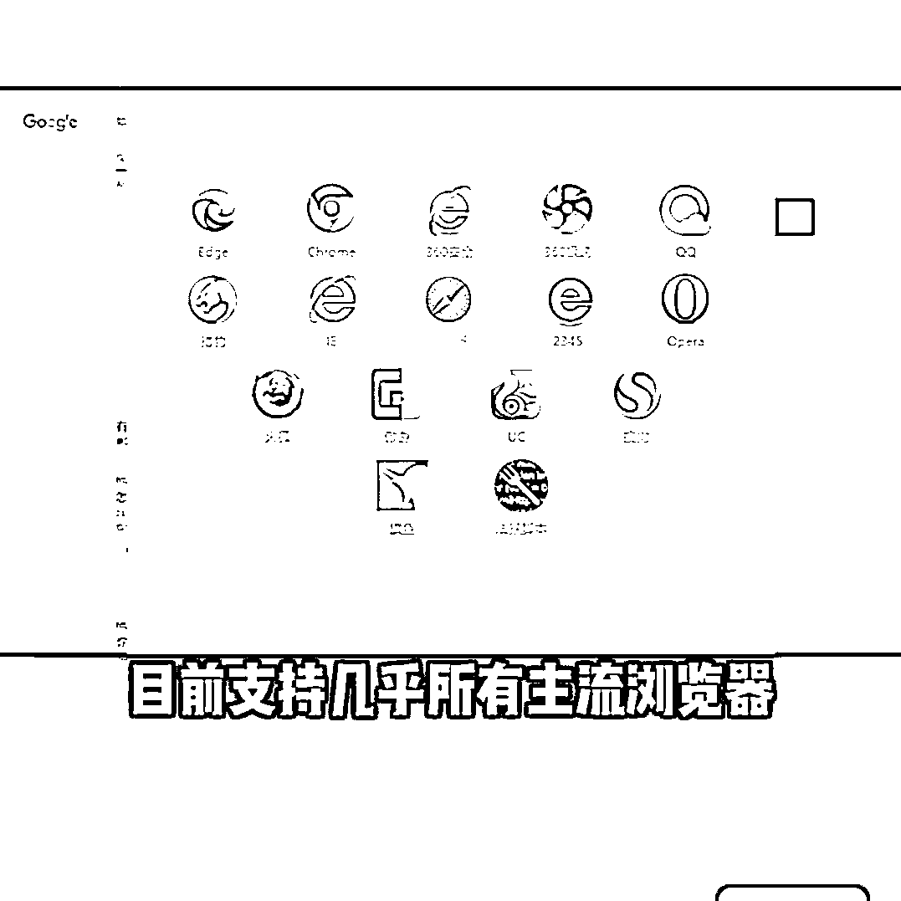

# 工具推荐：无需科学上网即可访问 ChatGPT 的插件 Merlin

> 原文：[`www.yuque.com/for_lazy/xkrm14/eoger1hxptyg5xmi`](https://www.yuque.com/for_lazy/xkrm14/eoger1hxptyg5xmi)

<ne-p id="ueed14c12" data-lake-id="ueed14c12"><ne-text id="u556d4873">作者： Leeka</ne-text></ne-p> <ne-p id="ueab106f1" data-lake-id="ueab106f1"><ne-text id="u49cf91d6">日期：2023-02-07</ne-text></ne-p> <ne-p id="ufa5747cd" data-lake-id="ufa5747cd"><ne-text id="uaeafc84c">点赞数：</ne-text><ne-text id="u1d96e87e" ne-bold="true">29</ne-text></ne-p> <ne-hole id="u63aff686" data-lake-id="u63aff686"><ne-card data-card-name="hr" data-card-type="block" id="IcvV8" data-event-boundary="card"><ne-p id="u957562a5" data-lake-id="u957562a5"><ne-text id="u8ac3228b">AI 相关，如何不科学上网也能用 Chat GPT？ 只需要用一个叫「Merlin」的插件就可以了 支持市面上绝大多数的浏览器，无需注册</ne-text> <ne-text id="ucf99a4ef">快捷键就可以唤醒，以 Chat GPT 的答案为参考 每天可以免费使用 15 次，换浏览器和 IP 就可以无限白嫖了[偷笑]</ne-text></ne-p> <ne-p id="u46e00321" data-lake-id="u46e00321"><ne-card data-card-name="image" data-card-type="inline" id="FILrK" data-event-boundary="card">  <ne-p id="uf60953a9" data-lake-id="uf60953a9"><ne-card data-card-name="image" data-card-type="inline" id="FuOmJ" data-event-boundary="card">  <ne-p id="u4241cc63" data-lake-id="u4241cc63"><ne-card data-card-name="image" data-card-type="inline" id="qGApo" data-event-boundary="card">  <ne-hole id="ud54b80a5" data-lake-id="ud54b80a5"><ne-card data-card-name="hr" data-card-type="block" id="pd72J" data-event-boundary="card"><ne-p id="u33bbcfdc" data-lake-id="u33bbcfdc"><ne-text id="uf322c78e">公众号懒人找资源，懒人专属群分享</ne-text></ne-p></ne-card></ne-hole></ne-card></ne-p></ne-card></ne-p></ne-card></ne-p></ne-card></ne-hole>