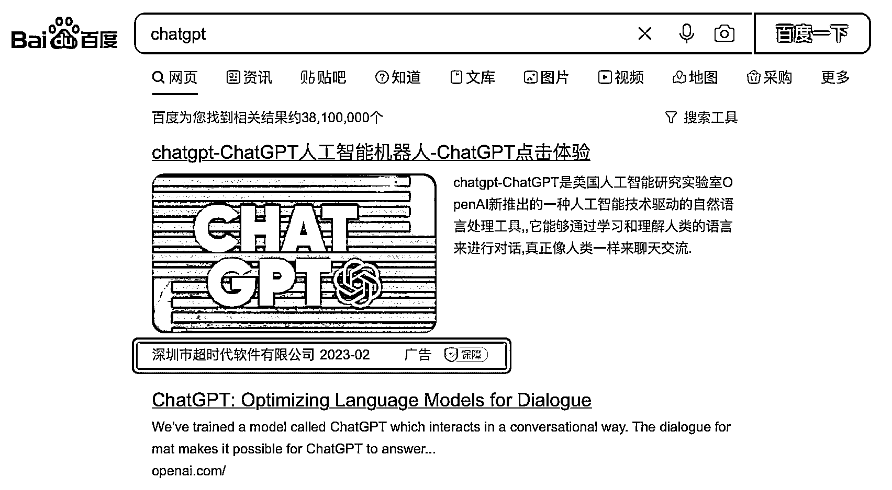
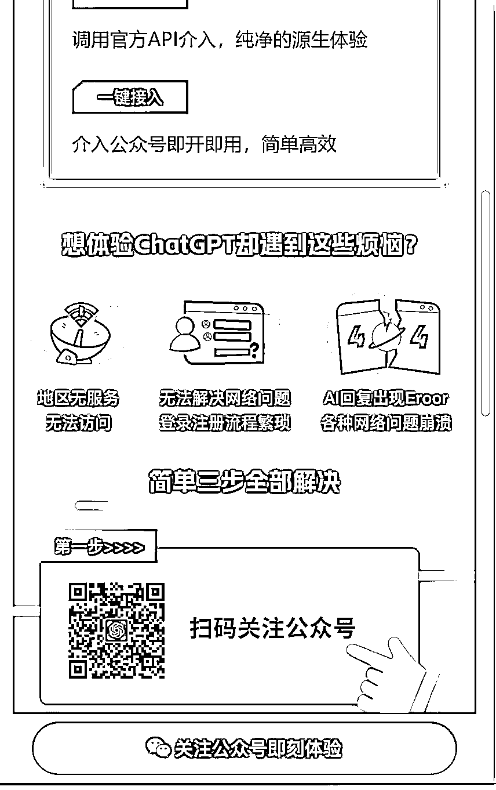
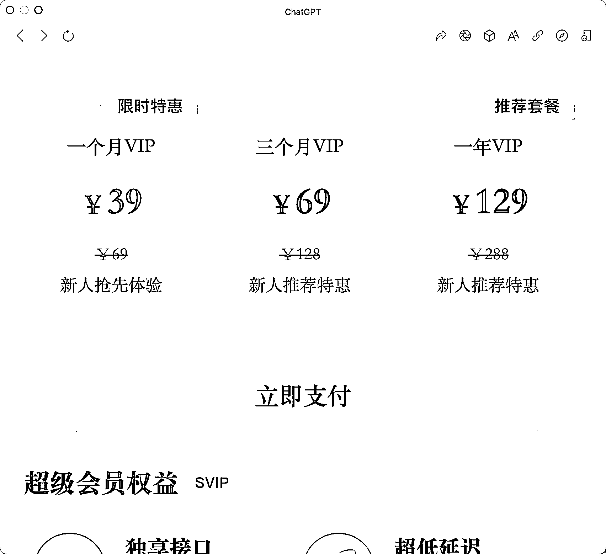

# 百度投放 ChatGPT 关键词，引流卖会员

> 原文：[`www.yuque.com/for_lazy/xkrm14/vt0cizy5lqy1gry6`](https://www.yuque.com/for_lazy/xkrm14/vt0cizy5lqy1gry6)

作者： 柳生

日期：2023-02-08

点赞数：15

<ne-hole id="ud8e4c57c" data-lake-id="ud8e4c57c"><ne-card data-card-name="hr" data-card-type="block" id="gdfSy" data-event-boundary="card">

已经有人开始用 chatgpt 赚钱了。 百度搜 chatgpt，排名第一的是个广告，引流到公众号之后，用户可以试用几次，之后售卖会员。

<ne-card data-card-name="image" data-card-type="inline" id="bbMsP" data-event-boundary="card">  <ne-p id="u88445100" data-lake-id="u88445100"><ne-card data-card-name="image" data-card-type="inline" id="UkHiQ" data-event-boundary="card">  <ne-p id="uaaeb7a3c" data-lake-id="uaaeb7a3c"><ne-card data-card-name="image" data-card-type="inline" id="Q3n0j" data-event-boundary="card">  <ne-p id="u16718380" data-lake-id="u16718380"><ne-card data-card-name="image" data-card-type="inline" id="MVfNa" data-event-boundary="card">  <ne-hole id="u1d83bfe4" data-lake-id="u1d83bfe4"><ne-card data-card-name="hr" data-card-type="block" id="dNC0o" data-event-boundary="card"><ne-p id="ubd9fd6c3" data-lake-id="ubd9fd6c3">公众号懒人找资源，懒人专属群分享

</ne-card></ne-hole></ne-card></ne-p></ne-card></ne-p></ne-card></ne-p></ne-card></ne-p></ne-card></ne-hole>