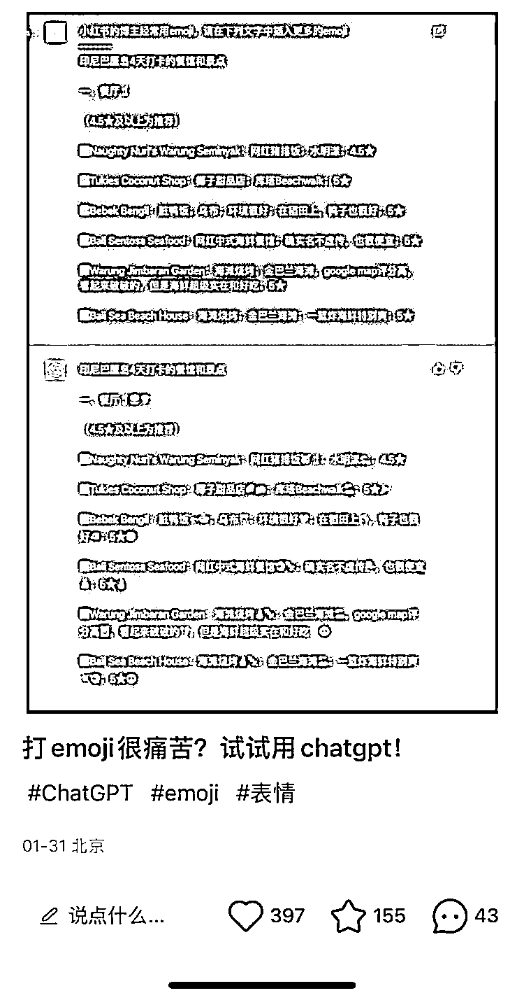

# 用 ChatGPT 快速小红书排版

> 原文：[`www.yuque.com/for_lazy/xkrm14/vwvu8e2sw21t991d`](https://www.yuque.com/for_lazy/xkrm14/vwvu8e2sw21t991d)

作者： 三林

日期：2023-02-06

点赞数：26

<ne-hole id="u33285038" data-lake-id="u33285038"><ne-card data-card-name="hr" data-card-type="block" id="XIksg" data-event-boundary="card">

用 ChatGPT 快速小红书排版，亮点：快速添加 emoji 表情，节省时间，可预见 AI 是人类创作的好助手。

<ne-card data-card-name="image" data-card-type="inline" id="Qa4Qq" data-event-boundary="card"></ne-card>

<ne-hole id="ub2f390e5" data-lake-id="ub2f390e5"><ne-card data-card-name="hr" data-card-type="block" id="QtAMo" data-event-boundary="card">

公众号懒人找资源，懒人专属群分享

</ne-card></ne-hole></ne-card></ne-hole>