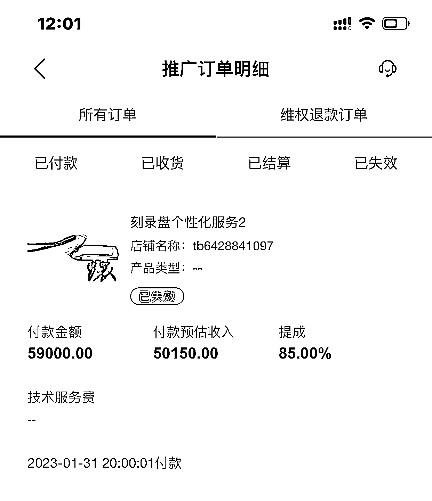

# 淘礼金 v3 账号开通方法

> 原文：[`www.yuque.com/for_lazy/xkrm14/zxkoy49sg201i0ug`](https://www.yuque.com/for_lazy/xkrm14/zxkoy49sg201i0ug)

作者： 撸货老刘

日期：2023-02-06

点赞数：12

<ne-hole id="ud219a9d1" data-lake-id="ud219a9d1">

说说外面收费 300+的淘礼金 v3 账号怎么开 因为自己刚入局淘客，对于老手们，肯定都知道淘礼金是什么？这里我就不做解释了，只说一下市场上接单的淘礼金 v3 是怎么开的，给大家省去 300+ 具体看如下微信沟通图 大家知道，淘礼金是 v3 等级，需要当月佣金够 5 万，然后次月 2 号生效。 所以，他们代开就是在当月最后一天，找合作店铺（为了保证不会发货）刷一笔 5 万佣的订单，然后等次月 2 号生效后申请退款，就这么简单。

<ne-hole id="uce09ba7a" data-lake-id="uce09ba7a">

公众号懒人找资源，懒人专属群分享

</ne-hole></ne-hole>