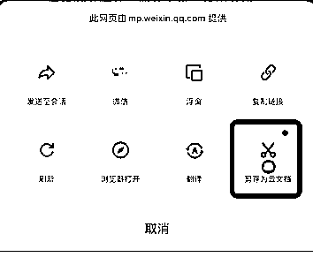

# 工具推荐：飞书插件飞书剪存

> 原文：[`www.yuque.com/for_lazy/xkrm14/wlrarkznu66qu77z`](https://www.yuque.com/for_lazy/xkrm14/wlrarkznu66qu77z)

作者： 何伟建

日期：2023-02-08

点赞数：47

对于经常使用飞书云文档或者飞书的圈友推荐一个插件：飞书剪存 它是一个兼容于各大浏览器的扩展程序。它可以将自动剥离广告后的网页正文一键保存至飞书云文档 支持电脑端和移动端，功能相当强大： 功能一：一键保存网页正文，告别手动复制粘贴：浏览到喜欢的网页，点击飞书剪存，即可将网页内容保存至你的飞书云文档中。 功能二：智能剥离网页广告，告别无用干扰信息：飞书剪存可以智能识别并去除悬浮或嵌在网页中的广告，还你干净、无噪的网页内容。 目前支持浏览器有： 360 安全/极速浏览器、Edge 浏览器、Chrome 浏览器、猎豹浏览器 安装方法：[安装、使用剪存插件](https://www.feishu.cn/hc/zh-CN/articles/606278856233)

  <ne-p id="udd74250a" data-lake-id="udd74250a">  <ne-p id="u4847cf6a" data-lake-id="u4847cf6a">公众号懒人找资源，懒人专属群分享

</ne-p></ne-p>