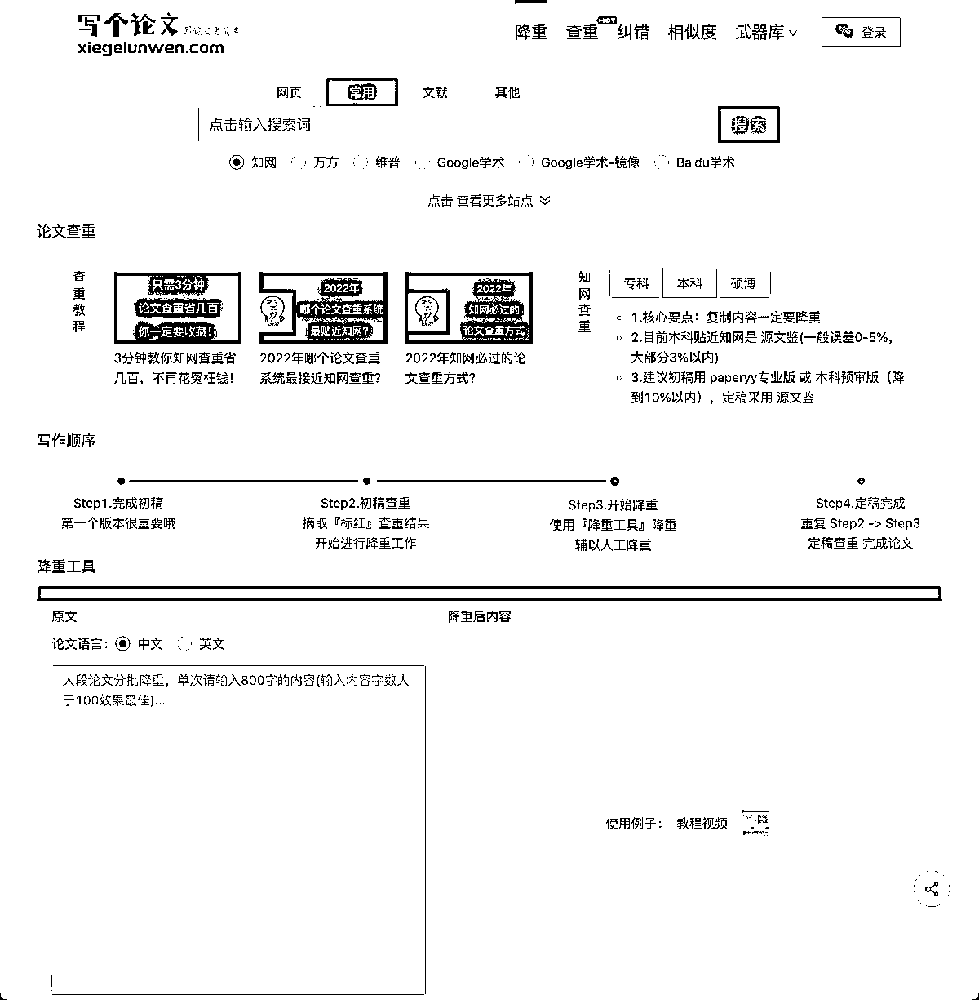

# 工具推荐：论文降重查重工具软件-写个论文

> 原文：[`www.yuque.com/for_lazy/xkrm14/mc1ms7sqbs7ahlbm`](https://www.yuque.com/for_lazy/xkrm14/mc1ms7sqbs7ahlbm)

<ne-p id="u7c6a07ac" data-lake-id="u7c6a07ac"><ne-text id="u1d0ea04f">作者： 大池</ne-text></ne-p> <ne-p id="u869d04bf" data-lake-id="u869d04bf"><ne-text id="u730fc119">日期：2023-02-08</ne-text></ne-p> <ne-p id="u87bbf1cc" data-lake-id="u87bbf1cc"><ne-text id="u2b6450ef">点赞数：</ne-text><ne-text id="u692948f9" ne-bold="true">24</ne-text></ne-p> <ne-hole id="udd78f92f" data-lake-id="udd78f92f"><ne-card data-card-name="hr" data-card-type="block" id="rLi4D" data-event-boundary="card"><ne-p id="u100beb96" data-lake-id="u100beb96"><ne-text id="u17cc8309">现在正是大学生写毕业论文的时候</ne-text> <ne-text id="u40f6a682">推荐个工具「写个论文」一个超好用的论文降重查重工具软件，让写论文更简单，写个论文支持通顺度、降重力度两个降重模式，轻松降低论文查重率，让写论文更简单。</ne-text> <ne-text id="uc89fa1f3">写个论文不仅是一款免费论文降重神器，而且还提供一站式聚合论文查重，包含：知网查重、维普查重、万方查重等服务，守护你毕业最后一站，使用需要注册登录，有免费额度体验，这条风向标应该能做一些事情。</ne-text> [<ne-text id="u54498ca8">写个论文+-+超好用的免费论文降重软件，让写论文更简单</ne-text>](https://www.xiegelunwen.com/)</ne-p> <ne-p id="u1aadfbb6" data-lake-id="u1aadfbb6"><ne-card data-card-name="image" data-card-type="inline" id="XNatO" data-event-boundary="card">  <ne-hole id="u2022c648" data-lake-id="u2022c648"><ne-card data-card-name="hr" data-card-type="block" id="Nieyz" data-event-boundary="card"><ne-p id="uabf752a2" data-lake-id="uabf752a2"><ne-text id="u67c0ec07">公众号懒人找资源，懒人专属群分享</ne-text></ne-p></ne-card></ne-hole></ne-card></ne-p></ne-card></ne-hole>