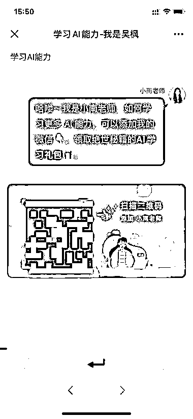

# 利用免登陆 ChatGPT 网站引流

> 原文：[`www.yuque.com/for_lazy/xkrm14/cslyh65uhiym8eb1`](https://www.yuque.com/for_lazy/xkrm14/cslyh65uhiym8eb1)

作者： 雪球

日期：2023-02-09

点赞数：9

<ne-hole id="ufeab0ecc" data-lake-id="ufeab0ecc">

制作免🪜ChatGPT 网站引流。 图片是风向标里看到圈友发的网站。 进去后跟 OpenAI 的网站高度相似。 一堆英文中的几个汉字特别醒目，点了一下 弹出对话框，用 AI 课引流到私域。

  <ne-p id="u969c7f3d" data-lake-id="u969c7f3d">  <ne-hole id="uecd0ec0d" data-lake-id="uecd0ec0d"><ne-p id="ue50d55f7" data-lake-id="ue50d55f7">公众号懒人找资源，懒人专属群分享

</ne-hole></ne-p></ne-p></ne-hole>