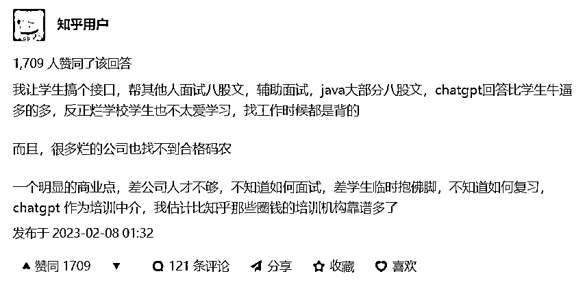

# 利用 chatGPT 制作垂直领域的内容站

> 原文：[`www.yuque.com/for_lazy/xkrm14/hqiwlg590y9lfpvz`](https://www.yuque.com/for_lazy/xkrm14/hqiwlg590y9lfpvz)

<ne-p id="u9ba16911" data-lake-id="u9ba16911"><ne-text id="u46e4130f">作者： 根叔</ne-text></ne-p> <ne-p id="u153bd82f" data-lake-id="u153bd82f"><ne-text id="ubae08a7d">日期：2023-02-09</ne-text></ne-p> <ne-p id="u4f4f522b" data-lake-id="u4f4f522b"><ne-text id="u83908879">点赞数：</ne-text><ne-text id="u43c437ac" ne-bold="true">10</ne-text></ne-p> <ne-hole id="u10789e3e" data-lake-id="u10789e3e"><ne-card data-card-name="hr" data-card-type="block" id="my5ES" data-event-boundary="card"><ne-p id="u8e329953" data-lake-id="u8e329953"><ne-text id="u43a9b871">利用 chatGPT 制作垂直领域的内容站，比如某编程语言的面试，可以先让 chatGPT 给出不同等级（初级、中级、高级等）面试题，然后再让 chatGPT 依次回答这些面试题，这样就有了很详细的面试题及答案，而且还是分好等级的。</ne-text> <ne-text id="ub4163048">对于求职者来说，死磕这份题库，就能增加通过面试的几率； 对于招聘者来说，可以从这份题库里寻找面试题，整理自己公司的面试题库。</ne-text></ne-p> <ne-p id="u6dfc5468" data-lake-id="u6dfc5468"><ne-card data-card-name="image" data-card-type="inline" id="WvBUR" data-event-boundary="card">  <ne-hole id="u3a0f6873" data-lake-id="u3a0f6873"><ne-card data-card-name="hr" data-card-type="block" id="hWwjZ" data-event-boundary="card"><ne-p id="ue173b8ee" data-lake-id="ue173b8ee"><ne-text id="ub97276eb">公众号懒人找资源，懒人专属群分享</ne-text></ne-p></ne-card></ne-hole></ne-card></ne-p></ne-card></ne-hole>