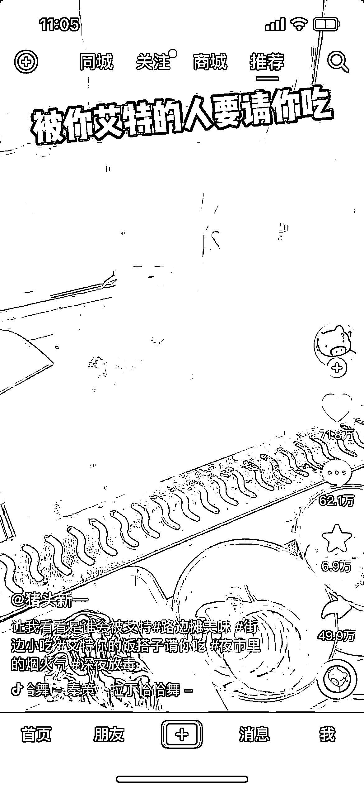

# 短视频互动式文案内容，激发观众评论，从而带来更高播放量

> 原文：[`www.yuque.com/for_lazy/xkrm14/hrl6nxo21lxvinhx`](https://www.yuque.com/for_lazy/xkrm14/hrl6nxo21lxvinhx)

<ne-p id="u0cefe826" data-lake-id="u0cefe826"><ne-text id="u480b9443">作者： 喵柒</ne-text></ne-p> <ne-p id="u3b2721e2" data-lake-id="u3b2721e2"><ne-text id="u33ea316a">日期：2023-02-08</ne-text></ne-p> <ne-p id="u154ad48f" data-lake-id="u154ad48f"><ne-text id="u80eb27c6">点赞数：</ne-text><ne-text id="u7d329e8f" ne-bold="true">47</ne-text></ne-p> <ne-hole id="u7f147e87" data-lake-id="u7f147e87"><ne-card data-card-name="hr" data-card-type="block" id="XhNLO" data-event-boundary="card"><ne-p id="u1de3ce6b" data-lake-id="u1de3ce6b"><ne-text id="u70e05d90">“被你艾特的人”+好事 这个句式文案真绝 把评论数大幅度提高了 也帮助到视频曝光等各方面数据</ne-text></ne-p> <ne-p id="ub492e792" data-lake-id="ub492e792"><ne-card data-card-name="image" data-card-type="inline" id="Z04Tw" data-event-boundary="card"></ne-card></ne-p> <ne-hole id="ubc281495" data-lake-id="ubc281495"><ne-card data-card-name="hr" data-card-type="block" id="c6tu8" data-event-boundary="card"><ne-p id="ua80875ca" data-lake-id="ua80875ca"><ne-text id="u6e4fc5a5">公众号懒人找资源，懒人专属群分享</ne-text></ne-p></ne-card></ne-hole></ne-card></ne-hole>