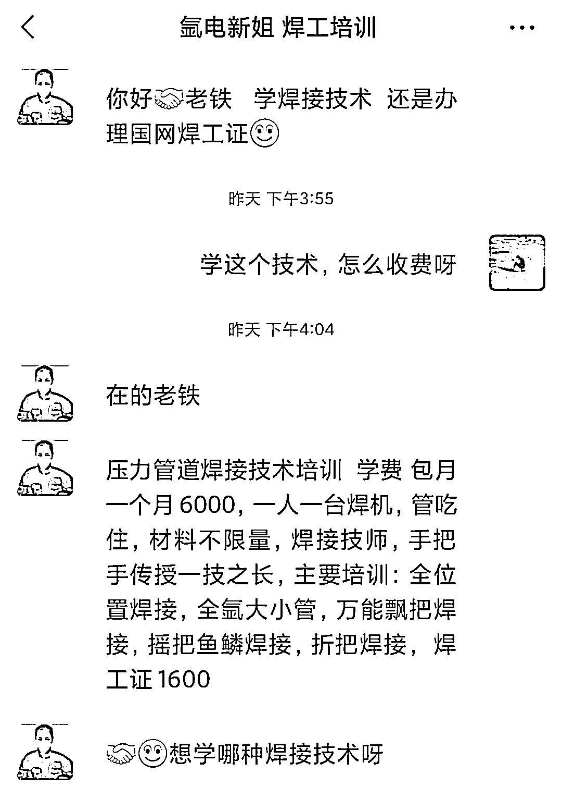

# 培训机构在抖音为线下技能培训引流

> 原文：[`www.yuque.com/for_lazy/xkrm14/hyfgv6r97pi7l6vk`](https://www.yuque.com/for_lazy/xkrm14/hyfgv6r97pi7l6vk)

<ne-p id="u993c414f" data-lake-id="u993c414f"><ne-text id="u52a2fe52">作者： 海海</ne-text></ne-p> <ne-p id="ue37dc8c6" data-lake-id="ue37dc8c6"><ne-text id="ua807c6bb">日期：2023-02-08</ne-text></ne-p> <ne-p id="uebadb5ee" data-lake-id="uebadb5ee"><ne-text id="uad6b9ae4">点赞数：</ne-text><ne-text id="ua5857089" ne-bold="true">27</ne-text></ne-p> <ne-hole id="u483d6db8" data-lake-id="u483d6db8"><ne-card data-card-name="hr" data-card-type="block" id="SWhtl" data-event-boundary="card"><ne-p id="ua2645e23" data-lake-id="ua2645e23"><ne-text id="u9b6602b6">真是任何行业在抖音都有机会放大呀，6000 元包吃住培训一个月电焊，看着也不贵呀</ne-text></ne-p> <ne-p id="uafb6fe8c" data-lake-id="uafb6fe8c"><ne-card data-card-name="image" data-card-type="inline" id="y36YI" data-event-boundary="card"></ne-card></ne-p> <ne-p id="ue2c40ec0" data-lake-id="ue2c40ec0"><ne-card data-card-name="image" data-card-type="inline" id="aM2Qf" data-event-boundary="card"></ne-card></ne-p> <ne-p id="u903f7180" data-lake-id="u903f7180"><ne-card data-card-name="image" data-card-type="inline" id="TA47S" data-event-boundary="card"></ne-card></ne-p> <ne-hole id="u7513cd2c" data-lake-id="u7513cd2c"><ne-card data-card-name="hr" data-card-type="block" id="q8fZP" data-event-boundary="card"><ne-p id="u3518b9a7" data-lake-id="u3518b9a7"><ne-text id="u7a697c1c">公众号懒人找资源，懒人专属群分享</ne-text></ne-p></ne-card></ne-hole></ne-card></ne-hole>