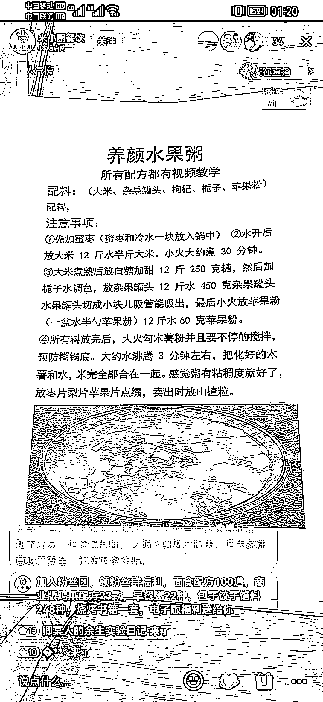

# 小吃培训，用抖音直播引流私域，做低转高

> 原文：[`www.yuque.com/for_lazy/xkrm14/gnnnra0p3qbu753l`](https://www.yuque.com/for_lazy/xkrm14/gnnnra0p3qbu753l)

<ne-p id="u5fdd4e7b" data-lake-id="u5fdd4e7b"><ne-text id="u3d7a7b0c">作者： 志豪</ne-text></ne-p> <ne-p id="uc6acf230" data-lake-id="uc6acf230"><ne-text id="ua0a9ab80">日期：2023-02-08</ne-text></ne-p> <ne-p id="u3bd00c66" data-lake-id="u3bd00c66"><ne-text id="u91794ab2">点赞数：</ne-text><ne-text id="u6ef200d6" ne-bold="true">22</ne-text></ne-p> <ne-hole id="u27a315e3" data-lake-id="u27a315e3"><ne-card data-card-name="hr" data-card-type="block" id="fUGiJ" data-event-boundary="card"><ne-p id="uac6853a4" data-lake-id="uac6853a4"><ne-text id="u0d561bf0">做小吃培训，用这方式从低价转高价，倒私域。挺香</ne-text></ne-p> <ne-p id="u3e6876d1" data-lake-id="u3e6876d1"><ne-card data-card-name="image" data-card-type="inline" id="Y6XY1" data-event-boundary="card"></ne-card></ne-p> <ne-p id="u30b8d49b" data-lake-id="u30b8d49b"><ne-card data-card-name="image" data-card-type="inline" id="RlZeo" data-event-boundary="card"></ne-card></ne-p> <ne-hole id="u794c442c" data-lake-id="u794c442c"><ne-card data-card-name="hr" data-card-type="block" id="UMftg" data-event-boundary="card"><ne-p id="uf65ada91" data-lake-id="uf65ada91"><ne-text id="u651adc4e">公众号懒人找资源，懒人专属群分享</ne-text></ne-p></ne-card></ne-hole></ne-card></ne-hole>