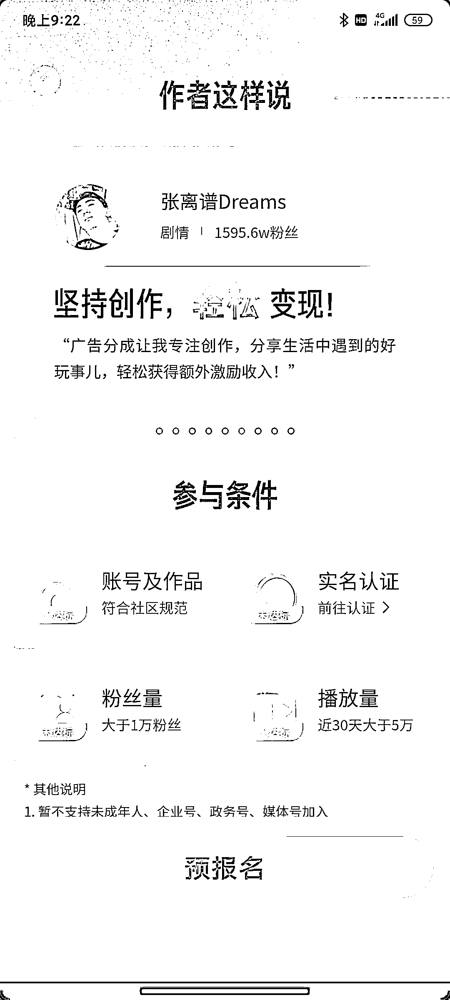

# 抖音新出了一个创作者广告分成计划

> 原文：[`www.yuque.com/for_lazy/xkrm14/hixuacf6glk757fg`](https://www.yuque.com/for_lazy/xkrm14/hixuacf6glk757fg)

<ne-p id="u63a87864" data-lake-id="u63a87864"><ne-text id="uaf305458">作者： TTTTL</ne-text></ne-p> <ne-p id="u4e29e283" data-lake-id="u4e29e283"><ne-text id="u857d7423">日期：2023-02-07</ne-text></ne-p> <ne-p id="uf6808792" data-lake-id="uf6808792"><ne-text id="u54703592">点赞数：</ne-text><ne-text id="u31e582dd" ne-bold="true">20</ne-text></ne-p> <ne-hole id="uccec4ccd" data-lake-id="uccec4ccd"><ne-card data-card-name="hr" data-card-type="block" id="k056p" data-event-boundary="card"><ne-p id="ue49008d8" data-lake-id="ue49008d8"><ne-text id="u3b99a5a2">抖音新出了一个创作者广告分成计划： 开通门槛： 1: 1w 粉丝 2: 近 30 天内帐号总播放量大于 5w 3: 作品合规 4: 帐号实名</ne-text> <ne-text id="ud06b06e0">值得注意的是，它的广告内容推送方式是： 用户进入你的主页后并且“连续浏览”内容时 广告才会以一条单独视频的形式向用户展现</ne-text> <ne-text id="u31368d73">感觉是和影视解说以及微情景剧/剧情类型的帐号十分贴合变现形式之一</ne-text></ne-p> <ne-p id="ud6d3f9e6" data-lake-id="ud6d3f9e6"><ne-card data-card-name="image" data-card-type="inline" id="mv3ms" data-event-boundary="card">  <ne-p id="u0ce7404a" data-lake-id="u0ce7404a"><ne-card data-card-name="image" data-card-type="inline" id="vyRj6" data-event-boundary="card">  <ne-hole id="u61492799" data-lake-id="u61492799"><ne-card data-card-name="hr" data-card-type="block" id="HPuGR" data-event-boundary="card"><ne-p id="u2420943f" data-lake-id="u2420943f"><ne-text id="u5b6a5bdc">公众号懒人找资源，懒人专属群分享</ne-text></ne-p></ne-card></ne-hole></ne-card></ne-p></ne-card></ne-p></ne-card></ne-hole>