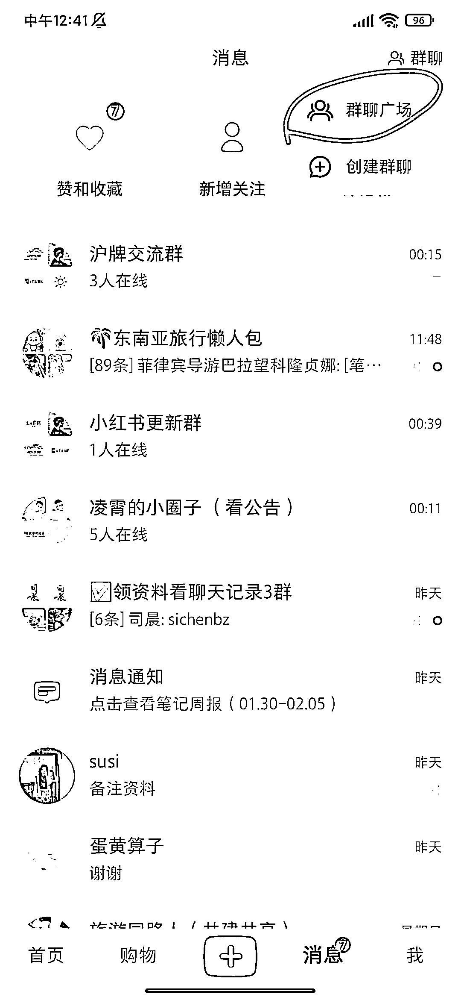

# 小红书群聊广场，卡关键词，导流私域

> 原文：[`www.yuque.com/for_lazy/xkrm14/va3o26cqhg927tdq`](https://www.yuque.com/for_lazy/xkrm14/va3o26cqhg927tdq)

<ne-p id="u9618b367" data-lake-id="u9618b367"><ne-text id="u4d44dd74">作者： 田新一</ne-text></ne-p> <ne-p id="u4cc0eea5" data-lake-id="u4cc0eea5"><ne-text id="u593a104a">日期：2023-02-07</ne-text></ne-p> <ne-p id="u16ca4a8b" data-lake-id="u16ca4a8b"><ne-text id="u9141c3c2">点赞数：</ne-text><ne-text id="u3db265ba" ne-bold="true">12</ne-text></ne-p> <ne-hole id="ua379fd39" data-lake-id="ua379fd39"><ne-card data-card-name="hr" data-card-type="block" id="psxnu" data-event-boundary="card"><ne-p id="uaccce373" data-lake-id="uaccce373"><ne-text id="u5834a787">小红书的群聊广场对引流到群特别有用，发布的文章的时候，记得带上自己的群。如图三所示，记得把群名优化一下，起的好听一点</ne-text></ne-p> <ne-p id="ue3539aed" data-lake-id="ue3539aed"><ne-card data-card-name="image" data-card-type="inline" id="DrDF8" data-event-boundary="card"></ne-card></ne-p> <ne-p id="u55b3100b" data-lake-id="u55b3100b"><ne-card data-card-name="image" data-card-type="inline" id="UHXn4" data-event-boundary="card"></ne-card></ne-p> <ne-p id="ud3b220da" data-lake-id="ud3b220da"><ne-card data-card-name="image" data-card-type="inline" id="Jkj41" data-event-boundary="card"></ne-card></ne-p> <ne-hole id="u23ab803d" data-lake-id="u23ab803d"><ne-card data-card-name="hr" data-card-type="block" id="x937N" data-event-boundary="card"><ne-p id="u92e9c359" data-lake-id="u92e9c359"><ne-text id="uf123a361">公众号懒人找资源，懒人专属群分享</ne-text></ne-p></ne-card></ne-hole></ne-card></ne-hole>