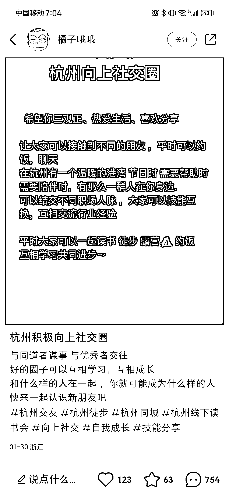
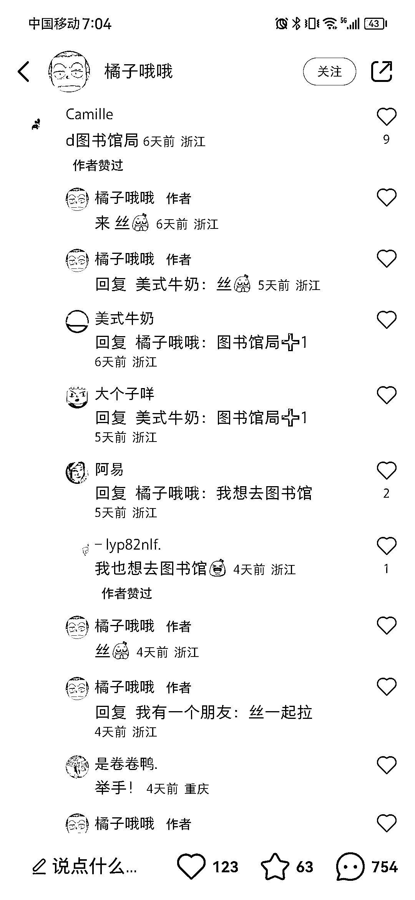

# 小红书同城引流思路分享

> 原文：[`www.yuque.com/for_lazy/xkrm14/pplgefmp0299se1v`](https://www.yuque.com/for_lazy/xkrm14/pplgefmp0299se1v)

作者： hedy

日期：2023-02-07

点赞数：14

同城引流思路分享 疫情放开后，线下社交需求变得异常强烈。 其他地区可参考这篇小红书笔记，同时结合评论区提到最多的图书馆局，吸引同城同频朋友。

公众号懒人找资源，懒人专属群分享

