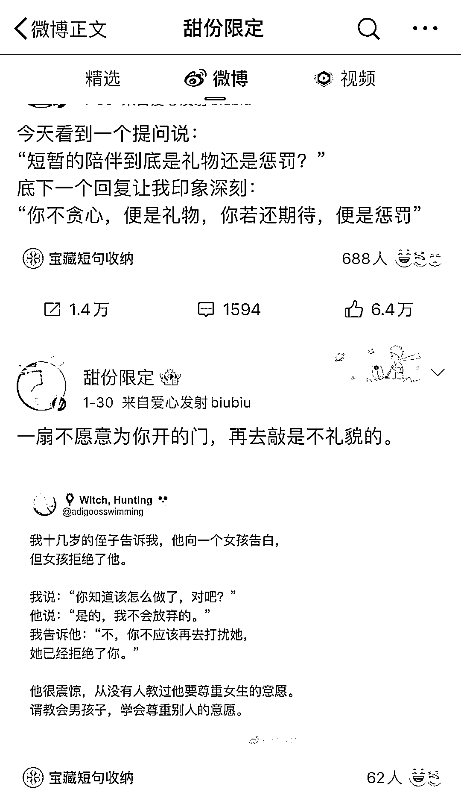

# 微博心灵鸡汤矩阵账号，赚流量主收益，引流命理变现

> 原文：[`www.yuque.com/for_lazy/xkrm14/pozb9nxlw5km7ax9`](https://www.yuque.com/for_lazy/xkrm14/pozb9nxlw5km7ax9)

<ne-p id="u4dafcb64" data-lake-id="u4dafcb64"><ne-text id="uf9b78868">作者： 慢慢</ne-text></ne-p> <ne-p id="uce96f215" data-lake-id="uce96f215"><ne-text id="u6daf3989">日期：2023-02-06</ne-text></ne-p> <ne-p id="uddc9175a" data-lake-id="uddc9175a"><ne-text id="u611904c2">点赞数：</ne-text><ne-text id="uce0f5da1" ne-bold="true">19</ne-text></ne-p> <ne-hole id="u50612a1e" data-lake-id="u50612a1e"><ne-card data-card-name="hr" data-card-type="block" id="nICdL" data-event-boundary="card"><ne-p id="u5075fd45" data-lake-id="u5075fd45"><ne-text id="ue2029006">生财的圈友，好像对微博上的项目关注不多，我来分享一个。 这个号背后应该是一个矩阵，不止这一个号，它单纯靠每天分享十多条“心灵鸡汤”，就涨粉到 70 多万。</ne-text> <ne-text id="u395dd2a3">有的“鸡汤”语录，甚至有好几万人点赞，评论，转发。</ne-text> <ne-text id="uaeb101cd">其实没什么技术含量，那些语录可以随便从小红书抄过来，名人语录更是假的，只是看起来有点道理而已，很多人愿意关注这种号。</ne-text> <ne-text id="u5713ac62">我观察了下，这一类号几乎所有的变现方式有两种： 1⃣️微博广告收益 2⃣️引流到微信去算命，其实相当于是命理博主在给自己用鸡汤引流——当然这才是收益的大头。</ne-text> <ne-text id="u3a8f6542">这类账号可以批量起号，起号成本低，除了命理博主，其他类型的产品，也可以考虑这么引流。</ne-text></ne-p> <ne-p id="ud0748d28" data-lake-id="ud0748d28"><ne-card data-card-name="image" data-card-type="inline" id="ycC52" data-event-boundary="card"></ne-card></ne-p> <ne-p id="ud60123c7" data-lake-id="ud60123c7"><ne-card data-card-name="image" data-card-type="inline" id="mRQEc" data-event-boundary="card"></ne-card></ne-p> <ne-p id="uc61dee52" data-lake-id="uc61dee52"><ne-card data-card-name="image" data-card-type="inline" id="vMmoc" data-event-boundary="card"></ne-card></ne-p> <ne-hole id="ub9f975bf" data-lake-id="ub9f975bf"><ne-card data-card-name="hr" data-card-type="block" id="LukjI" data-event-boundary="card"><ne-p id="u9a934e05" data-lake-id="u9a934e05"><ne-text id="u9e3cd035">公众号懒人找资源，懒人专属群分享</ne-text></ne-p></ne-card></ne-hole></ne-card></ne-hole>