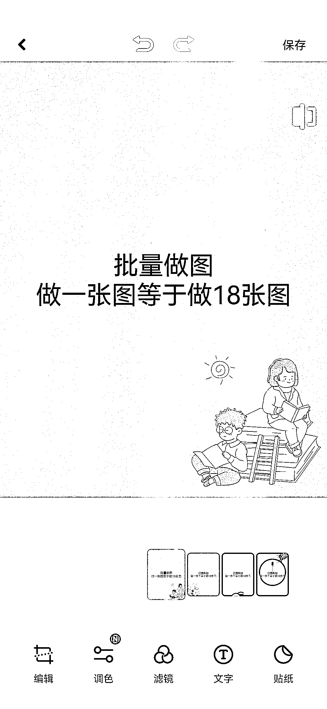

# 美图秀秀批量做图

> 原文：[`www.yuque.com/for_lazy/xkrm14/gl6oehvhfha3tohk`](https://www.yuque.com/for_lazy/xkrm14/gl6oehvhfha3tohk)

作者： 陈龙

日期：2023-02-06

点赞数：21

<ne-hole id="u24f39247" data-lake-id="u24f39247"><ne-card data-card-name="hr" data-card-type="block" id="QS4aC" data-event-boundary="card">

美图秀秀批量做图 通过去水印，得到别人的爆款模板，然后用小红书批量做图，很方便 特别是当我们手动做几个账号的时候，很实用

<ne-card data-card-name="image" data-card-type="inline" id="EsVpg" data-event-boundary="card">  <ne-p id="uc6317e5e" data-lake-id="uc6317e5e"><ne-card data-card-name="image" data-card-type="inline" id="FKCLm" data-event-boundary="card">  <ne-hole id="u3524eb8a" data-lake-id="u3524eb8a"><ne-card data-card-name="hr" data-card-type="block" id="zUOhA" data-event-boundary="card"><ne-p id="ubc779b44" data-lake-id="ubc779b44">公众号懒人找资源，懒人专属群分享

</ne-card></ne-hole></ne-card></ne-p></ne-card></ne-p></ne-card></ne-hole>