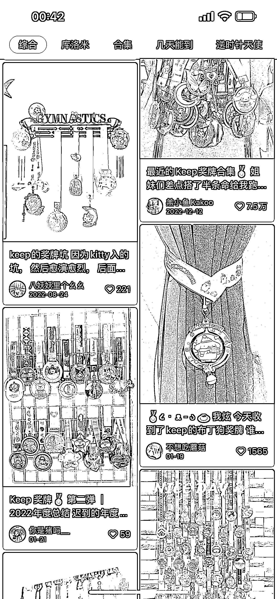

# Keep 靠着卖奖牌就卖了 5 个亿

> 原文：[`www.yuque.com/for_lazy/xkrm14/fq8vva1g7bnk2tt6`](https://www.yuque.com/for_lazy/xkrm14/fq8vva1g7bnk2tt6)

作者： JIM

日期：2023-02-06

点赞数：14

Keep 试了这么多变现模式都不太顺，结果靠着卖奖牌就卖了 5 个亿。 奖牌能卖爆，还是低估了健身小白是有多么的小白。 Keep 一定也惊醒了，弄什么付费会员、运动装备、健身数据、帕梅拉什么的，虽然这都是健身该干的事，但还是太绕了，完全没必要。 什么是健身小白？ 只在春暖花开时健身，且坚持不了俩星期 在 Keep 只练同一个课程，永远是那一个 健身只为减肚子或瘦小腿，但又没方法 健身时，满脑子都在想拍照发圈 所以，39 块钱的奖牌，好看、不贵、能发圈，还证明自己曾经健身过，小白的需求都满足了。 如果做的是小白，那么就直戳戳的满足小白的诉求，适度的放弃一些在专业层面的坚持，虽然有点讽刺，但也不丢人。

公众号懒人找资源，懒人专属群分享

