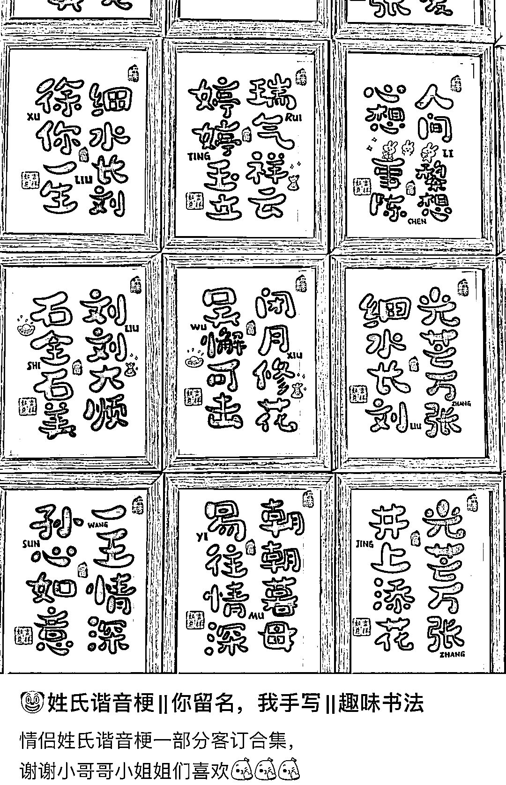
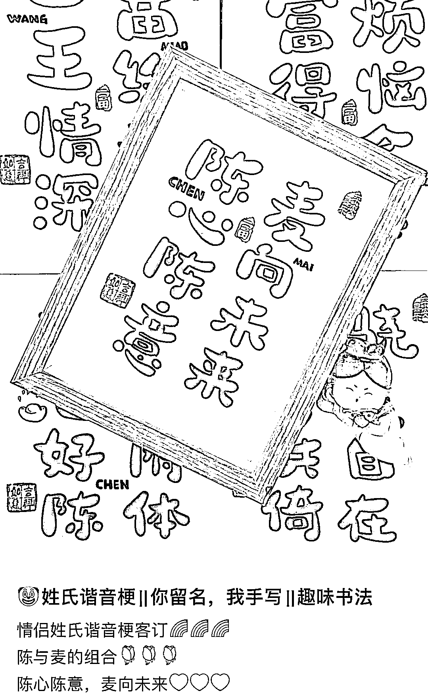

# 小红书情侣姓氏谐音梗笔记，互动数据好

> 原文：[`www.yuque.com/for_lazy/xkrm14/bf7p2cvstl4szek4`](https://www.yuque.com/for_lazy/xkrm14/bf7p2cvstl4szek4)

作者： 斑马森林

日期：2023-02-10

点赞数：22

<ne-hole id="ue0667d2a" data-lake-id="ue0667d2a">

情侣姓氏谐音梗，很小众的情侣周边，引导用户在评论区留姓氏，互动数据特别好： 1）谐音梗素材网上搜索即可 2）字体手写或者用第三方软件生成，打印出来 3）制作成周边摆件（贴纸等） 平常的流量数据就很不错，情人节马上到了，应该可以迎来一波小高峰

<ne-hole id="uf9e2c5b6" data-lake-id="uf9e2c5b6">

公众号懒人找资源，懒人专属群分享

</ne-hole></ne-hole>