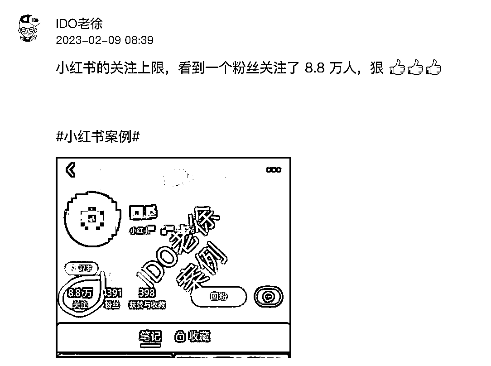

# 小红书关注上限

> 原文：[`www.yuque.com/for_lazy/xkrm14/mcnyv57anle5pgxg`](https://www.yuque.com/for_lazy/xkrm14/mcnyv57anle5pgxg)

<ne-p id="u11e91292" data-lake-id="u11e91292"><ne-text id="u37374485">作者： IDO 老徐</ne-text></ne-p> <ne-p id="u7b3cef75" data-lake-id="u7b3cef75"><ne-text id="u045f37bb">日期：2023-02-09</ne-text></ne-p> <ne-p id="ucea9b559" data-lake-id="ucea9b559"><ne-text id="u5fd79820">点赞数：</ne-text><ne-text id="u52bb2a48" ne-bold="true">10</ne-text></ne-p> <ne-hole id="u8baf336a" data-lake-id="u8baf336a"><ne-card data-card-name="hr" data-card-type="block" id="Dvgld" data-event-boundary="card"><ne-p id="u81c73a0f" data-lake-id="u81c73a0f"><ne-text id="uf9f7bc8e">小红书关注上限 401</ne-text></ne-p> <ne-p id="uf22b53f1" data-lake-id="uf22b53f1"><ne-card data-card-name="image" data-card-type="inline" id="Vnkli" data-event-boundary="card"></ne-card></ne-p> <ne-hole id="u3d85e725" data-lake-id="u3d85e725"><ne-card data-card-name="hr" data-card-type="block" id="BcdWC" data-event-boundary="card"><ne-p id="u390d1a9d" data-lake-id="u390d1a9d"><ne-text id="u67a297de">公众号懒人找资源，懒人专属群分享</ne-text></ne-p></ne-card></ne-hole></ne-card></ne-hole>