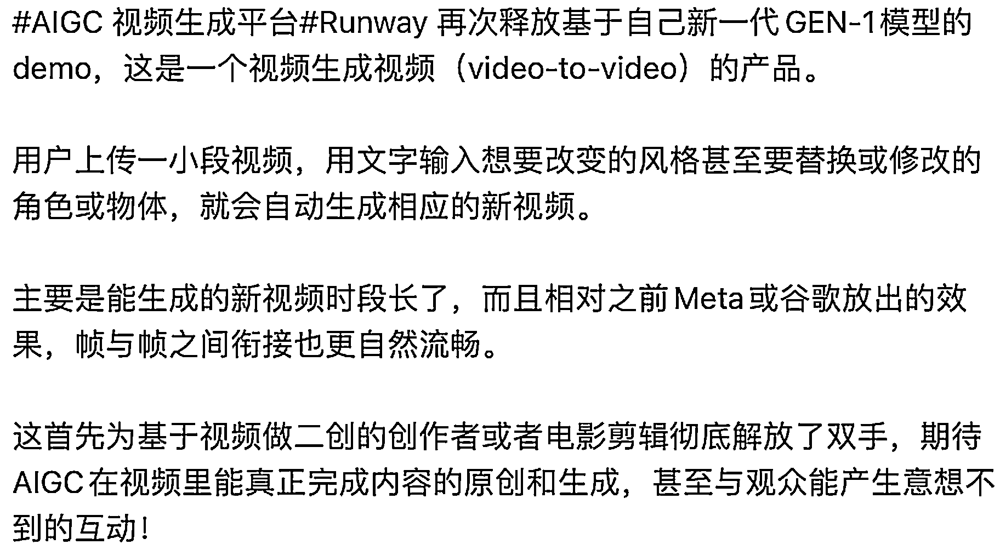

# 把 YTB 热搜词对应的视频，V To V 可以做原创视频素材站

> 原文：[`www.yuque.com/for_lazy/xkrm14/fg7h2u5nxqiyu8a4`](https://www.yuque.com/for_lazy/xkrm14/fg7h2u5nxqiyu8a4)

作者： 子木

日期：2023-02-08

点赞数：29

《0 资源，做出 3 个日 UV 过十万、7-8 个日 UV 过万的网站，分享我获得无限网站流量的秘籍》 按小排老师文章思路： 把 YTB 热搜词对应的视频，V To V 可以做原创视频素材站 - AI 解放内容产出难 - SEO 搞流量，广告等其他方式变现 如图[《0 资源，做出 3 个日 UV 过十万、7-8 个日 UV 过万的网站，分享我获得无限网站流量的秘籍》](https://articles.zsxq.com/id_hu89k3mhln95.html)

  

公众号懒人找资源，懒人专属群分享作者： 子木

日期：2023-02-08

点赞数：29

《0 资源，做出 3 个日 UV 过十万、7-8 个日 UV 过万的网站，分享我获得无限网站流量的秘籍》 按小排老师文章思路： 把 YTB 热搜词对应的视频，V To V 可以做原创视频素材站 - AI 解放内容产出难 - SEO 搞流量，广告等其他方式变现 如图[《0 资源，做出 3 个日 UV 过十万、7-8 个日 UV 过万的网站，分享我获得无限网站流量的秘籍》](https://articles.zsxq.com/id_hu89k3mhln95.html)

  

公众号懒人找资源，懒人专属群分享

</ne-p></ne-p>