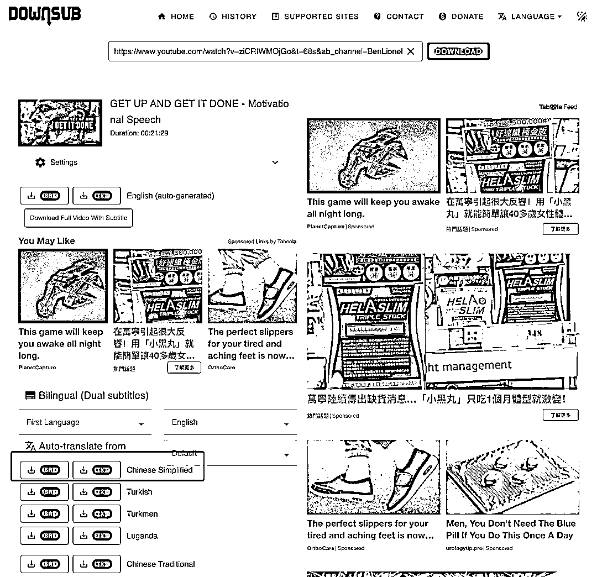

# 油管视频翻译搬运玩法

> 原文：[`www.yuque.com/for_lazy/xkrm14/ni1wkxynhi5bdizi`](https://www.yuque.com/for_lazy/xkrm14/ni1wkxynhi5bdizi)

<ne-p id="u14aff49f" data-lake-id="u14aff49f"><ne-text id="u2ec447b3">作者： 姬小光</ne-text></ne-p> <ne-p id="u342ab19a" data-lake-id="u342ab19a"><ne-text id="u5bb42629">日期：2023-02-07</ne-text></ne-p> <ne-p id="u3c9871ea" data-lake-id="u3c9871ea"><ne-text id="u505568fd">点赞数：</ne-text><ne-text id="ufe2090ab" ne-bold="true">30</ne-text></ne-p> <ne-hole id="uaec1e6d5" data-lake-id="uaec1e6d5"><ne-card data-card-name="hr" data-card-type="block" id="tvNkq" data-event-boundary="card"><ne-p id="u86085930" data-lake-id="u86085930"><ne-text id="u380da527">油管视频翻译搬运玩法： 1\. 选一个领域，比如励志，关注几个油管号 2\. 搬运视频，有很多软件可以用 3\. 下载中文字幕，使用</ne-text> <ne-text id="u0185e768">粘贴油管链接，下载简体中文字幕 4\. 字幕同步，可以手动编辑，也可以找可以同步时间轴字幕的软件，也有很多 5\. 封面可以用搜狗图片翻译，直接生成中文封面</ne-text> <ne-text id="u29939f6f">6\. 发布翻译过的视频到国内平台</ne-text> <ne-text id="uc849b41f">已经有不少类似账号做了，这里拆解下思路，毕竟人家都是付费收徒，我这可是免费的[呲牙][呲牙]</ne-text>[<ne-text id="udfe737cf">Download+subtitles+from+Youtube,+Viki,+Viu,+Vlive+...</ne-text>](https://downsub.com/)</ne-p> <ne-p id="u741fe399" data-lake-id="u741fe399"><ne-card data-card-name="image" data-card-type="inline" id="Wdk1c" data-event-boundary="card"></ne-card></ne-p> <ne-p id="u156d380c" data-lake-id="u156d380c"><ne-card data-card-name="image" data-card-type="inline" id="ANCed" data-event-boundary="card"></ne-card></ne-p> <ne-p id="u9b6a6393" data-lake-id="u9b6a6393"><ne-card data-card-name="image" data-card-type="inline" id="YTFrL" data-event-boundary="card"></ne-card></ne-p> <ne-hole id="uda54c47b" data-lake-id="uda54c47b"><ne-card data-card-name="hr" data-card-type="block" id="pfN6Z" data-event-boundary="card"><ne-p id="u1c1f2d32" data-lake-id="u1c1f2d32"><ne-text id="u2fc508a0">公众号懒人找资源，懒人专属群分享</ne-text></ne-p></ne-card></ne-hole></ne-card></ne-hole>