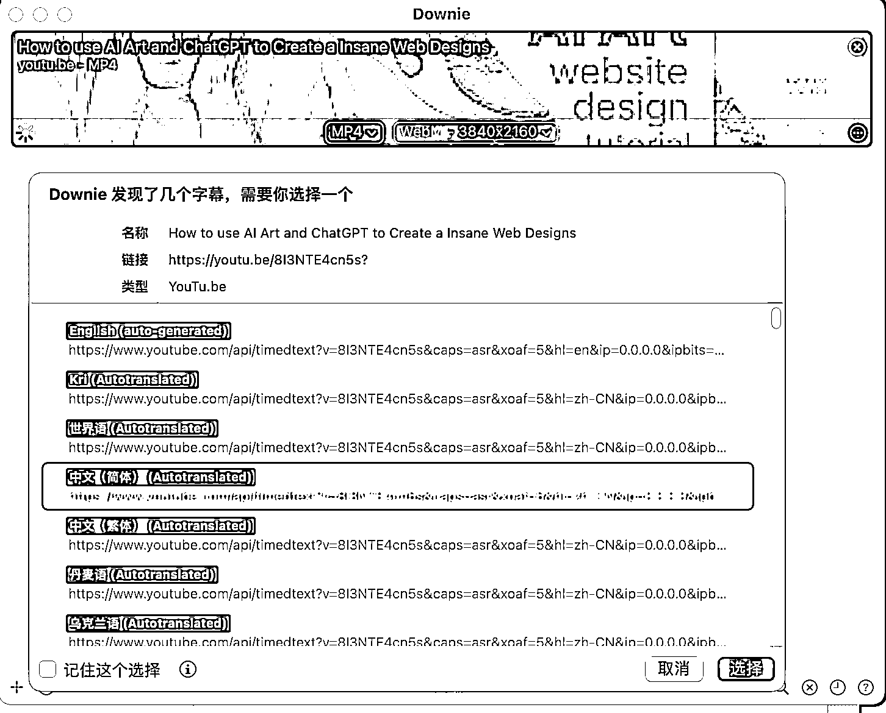
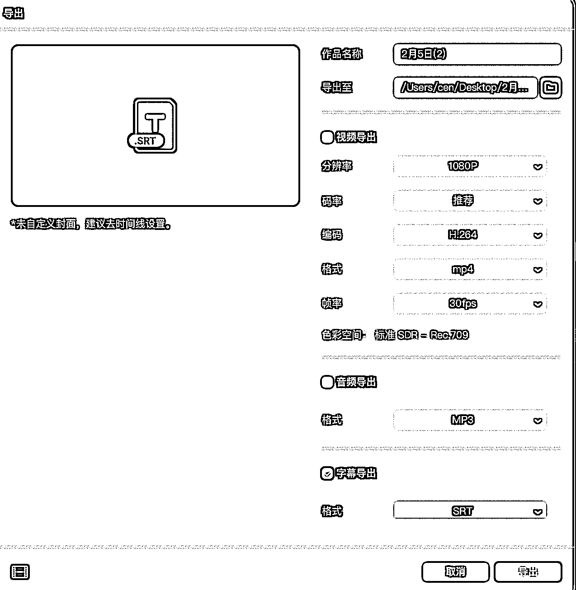
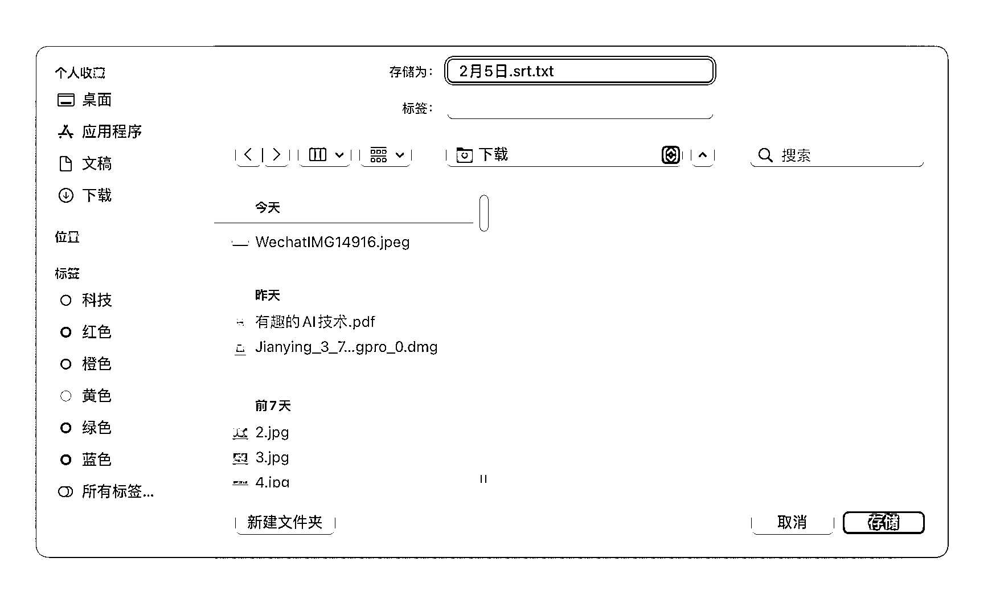

# 四步完成机器翻译油管视频

> 原文：[`www.yuque.com/for_lazy/xkrm14/uvapbul3h1yegfbk`](https://www.yuque.com/for_lazy/xkrm14/uvapbul3h1yegfbk)

作者： 一堆薄码

日期：2023-02-06

点赞数：26

<ne-hole id="u6d011cd2" data-lake-id="u6d011cd2">

最多四步完成机器翻译油管视频 源文件有字幕方案 第一步：Dowine（图 1）,这个是 MAC 用的软件，可以下载大多数视频网站的内容，YouTube 等自然不在话下，最重要的可以下载 YouTube 的字幕文件（.srt 文件），而且是自动翻译版本的（见图 2） （WIN 上也有类似的软件，但我没有 WIN，就不做推荐了） 第二步：剪映专业版里导入本地字幕就搞定了（图 3） 源文件无字幕方案 第一步：正常下载无字幕源文件（图 1） 第二步：剪映识别字幕（图 4），然后输出纯字幕文件（.srt 文件）（图 5） 第三步：在 chrome 打开字幕文件然后翻译成中文后保存（Chrome 翻译要科学上网）（图 6）保存时注意文件后缀（.srt）（图 7） 注：这一步方法很多，明白逻辑就好了，将字幕文件改成.txt 后缀后就是一个普通文档，然后用百度翻译（1 次免费，多次收费）等翻译软件就可以完成文档的翻译，然后再讲后缀改回（.srt）就好了，注意检查一下字幕文件格式不能变，要不字幕会出错！ 第四步：剪映专业版里导入本地字幕就搞定了（图 3）

  <ne-p id="u4bf41f52" data-lake-id="u4bf41f52">  <ne-p id="ua90cd38f" data-lake-id="ua90cd38f">  <ne-p id="u14c27acc" data-lake-id="u14c27acc">  <ne-p id="ub5033750" data-lake-id="ub5033750">  <ne-p id="ud1691208" data-lake-id="ud1691208">  <ne-p id="ufdab1f42" data-lake-id="ufdab1f42">  <ne-hole id="u626c4864" data-lake-id="u626c4864"><ne-p id="u9f6dfcdf" data-lake-id="u9f6dfcdf">公众号懒人找资源，懒人专属群分享

</ne-hole></ne-p></ne-p></ne-p></ne-p></ne-p></ne-p></ne-p></ne-hole>