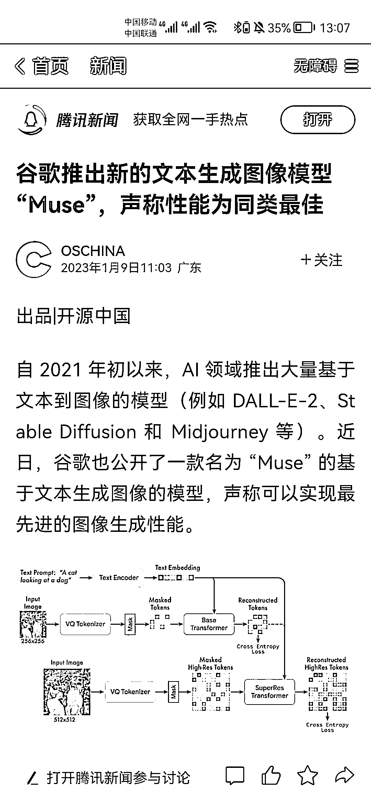
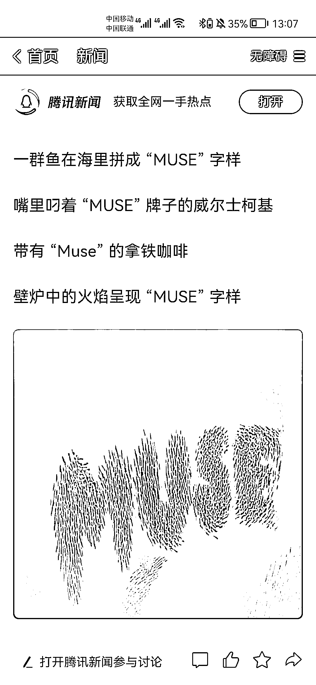

# AI 相关，Google 推出的 Muse

> 原文：[`www.yuque.com/for_lazy/xkrm14/anxwr32p7h82np0f`](https://www.yuque.com/for_lazy/xkrm14/anxwr32p7h82np0f)

作者： Leeka

日期：2023-02-07

点赞数：11

<ne-hole id="u7b55d770" data-lake-id="u7b55d770"><ne-card data-card-name="hr" data-card-type="block" id="ja9tD" data-event-boundary="card">

AI 相关，Google 推出的 Muse 号称「设计师 AI」 仅通过文字就能产出图片（当然这是基本） 重点是生成速度特别快，批量工作更省时省力

<ne-card data-card-name="image" data-card-type="inline" id="RPF7i" data-event-boundary="card">  <ne-p id="u135cee9e" data-lake-id="u135cee9e"><ne-card data-card-name="image" data-card-type="inline" id="qwgSD" data-event-boundary="card">  <ne-p id="u767d230a" data-lake-id="u767d230a"><ne-card data-card-name="image" data-card-type="inline" id="vsAkT" data-event-boundary="card">  <ne-hole id="u40b66dd8" data-lake-id="u40b66dd8"><ne-card data-card-name="hr" data-card-type="block" id="Ku441" data-event-boundary="card"><ne-p id="u0d553dc8" data-lake-id="u0d553dc8">公众号懒人找资源，懒人专属群分享

</ne-card></ne-hole></ne-card></ne-p></ne-card></ne-p></ne-card></ne-p></ne-card></ne-hole>