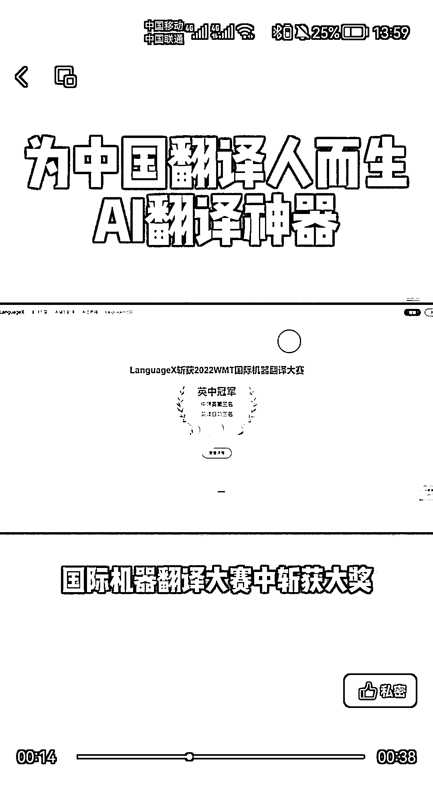
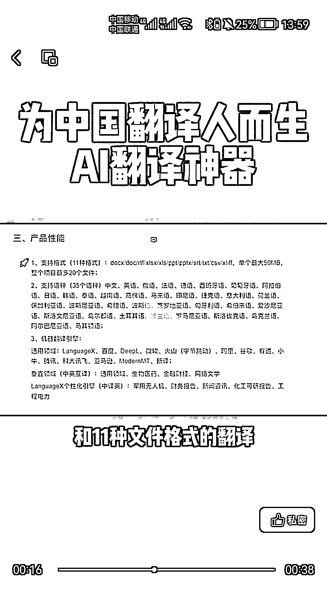

# AI 相关，号称最适合中国人的翻译软件 LanguageX

> 原文：[`www.yuque.com/for_lazy/xkrm14/cqmffhtp7wpcupsd`](https://www.yuque.com/for_lazy/xkrm14/cqmffhtp7wpcupsd)

作者： Leeka

日期：2023-02-06

点赞数：26

AI 相关，号称最适合中国人的翻译软件 比谷歌和 DeepL 还要好用的 LanguageX 在 2022 的国际机器翻译获得大奖 支持 35 种语言和 11 种文件格式 可以根据领域和个人需求，成为最适合用户的翻译软件，同时内嵌了主流翻译软件，供对比选择

  <ne-p id="u0b770888" data-lake-id="u0b770888">  <ne-p id="ufa0ace29" data-lake-id="ufa0ace29">  <ne-p id="ub32561e8" data-lake-id="ub32561e8">公众号懒人找资源，懒人专属群分享

</ne-p></ne-p></ne-p>