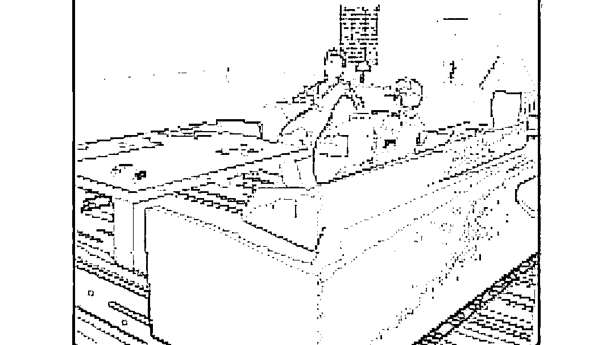

# AI 生成的情景喜剧，互动引领剧情，周边变现

> 原文：[`www.yuque.com/for_lazy/xkrm14/bgslqvu7n0ethtgu`](https://www.yuque.com/for_lazy/xkrm14/bgslqvu7n0ethtgu)

作者： Darren

日期：2023-02-07

点赞数：3

Nothing,Forever 是一部 AI 生成的情景喜剧，放在 Twitch 上直播。从 2 月 1 日起，差不多日均新增 3 万粉丝的水平。 在剧情上，Nothing,Forever 记录了 3 男 1 女的生活日常。画质上，给人上世纪 90 年代 PC 端游戏的感觉，背景饱和度很高；人物动态并不丝滑，声音也能明显听出是机器合成。但一想到这全是 AI 生成的内容，还是挺牛逼。 Nothing,Forever 是 AI、也是 UGC。创始人之一 Skyler Hartle 在 Reddit 动态里介绍，Nothing,Forever 采用了 OpenAI 的 GPT-3 语言预测模型，并监控了 Twitch 评论区用户的实时聊天，用户的讨论有可能改变剧集设定的走向，这一点更牛逼了。 现在除了 Twitch 打赏，Nothing,Forever 还可以通过 Patreon 和卖周边变现。

  

  

  

公众号懒人找资源，懒人专属群分享

