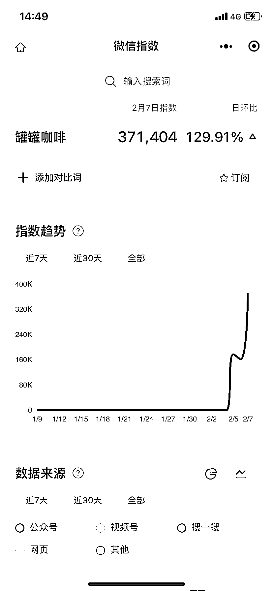

# 电商选品，「罐罐咖啡」关键词搜索量飙升到 37 万

> 原文：[`www.yuque.com/for_lazy/xkrm14/hvl1gyt3g594zvyq`](https://www.yuque.com/for_lazy/xkrm14/hvl1gyt3g594zvyq)

<ne-p id="u047be1f4" data-lake-id="u047be1f4"><ne-text id="u1cdfbf3d">作者： 罗破帽</ne-text></ne-p> <ne-p id="ub7638fb6" data-lake-id="ub7638fb6"><ne-text id="u0a5c135d">日期：2023-02-08</ne-text></ne-p> <ne-p id="uf34bf207" data-lake-id="uf34bf207"><ne-text id="u5df267f4">点赞数：</ne-text><ne-text id="ufb919d3c" ne-bold="true">19</ne-text></ne-p> <ne-hole id="uf811c510" data-lake-id="uf811c510"><ne-card data-card-name="hr" data-card-type="block" id="bIk4E" data-event-boundary="card"><ne-p id="ue2a6ed42" data-lake-id="ue2a6ed42"><ne-text id="u734fa73c">✅异常值，「罐罐咖啡」关键词搜索量飙升到 37 万。 【链接：】</ne-text>[<ne-text id="u35c4e187">一天入账 2.7 万，县城发货的“全国包邮咖啡”正在兴起-虎嗅网</ne-text>](https://www.huxiu.com/article/787137.html)</ne-p> <ne-p id="ud0910def" data-lake-id="ud0910def"><ne-card data-card-name="image" data-card-type="inline" id="eJEme" data-event-boundary="card">  <ne-hole id="u425a8fca" data-lake-id="u425a8fca"><ne-card data-card-name="hr" data-card-type="block" id="HxyTG" data-event-boundary="card"><ne-p id="u2891115c" data-lake-id="u2891115c"><ne-text id="uf393f31a">公众号懒人找资源，懒人专属群分享</ne-text></ne-p></ne-card></ne-hole></ne-card></ne-p></ne-card></ne-hole>