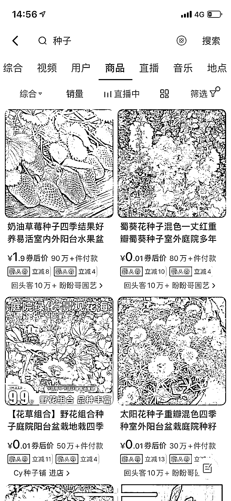

# 春季来临，电商平台花卉种子会热销

> 原文：[`www.yuque.com/for_lazy/xkrm14/afk6h4r7y2wx2zmv`](https://www.yuque.com/for_lazy/xkrm14/afk6h4r7y2wx2zmv)

<ne-p id="uc469dc12" data-lake-id="uc469dc12"><ne-text id="u60fcb614">作者： 丁 Ding</ne-text></ne-p> <ne-p id="ua43c4778" data-lake-id="ua43c4778"><ne-text id="uaa7497d4">日期：2023-02-10</ne-text></ne-p> <ne-p id="u05fa4bcf" data-lake-id="u05fa4bcf"><ne-text id="ud3511a51">点赞数：</ne-text><ne-text id="u56a33071" ne-bold="true">18</ne-text></ne-p> <ne-hole id="u7e1cb7e3" data-lake-id="u7e1cb7e3"><ne-card data-card-name="hr" data-card-type="block" id="yRPF0" data-event-boundary="card"><ne-p id="ucbbc4717" data-lake-id="ucbbc4717"><ne-text id="u1b31254a">立春过后，种子的春播都要安排上了。 平台上各种蔬菜或者花卉的种子销量都很惊人，做带货的老板们可以关注一下。</ne-text></ne-p> <ne-p id="u5b98d761" data-lake-id="u5b98d761"><ne-card data-card-name="image" data-card-type="inline" id="jdX5x" data-event-boundary="card">  <ne-p id="u9e24cf29" data-lake-id="u9e24cf29"><ne-card data-card-name="image" data-card-type="inline" id="Bd6ol" data-event-boundary="card"></ne-card></ne-p> <ne-p id="uf6c3971a" data-lake-id="uf6c3971a"><ne-card data-card-name="image" data-card-type="inline" id="n9VKX" data-event-boundary="card">  <ne-hole id="u1e42b4a5" data-lake-id="u1e42b4a5"><ne-card data-card-name="hr" data-card-type="block" id="RGh22" data-event-boundary="card"><ne-p id="u2cc79b9b" data-lake-id="u2cc79b9b"><ne-text id="u7b165590">公众号懒人找资源，懒人专属群分享</ne-text></ne-p></ne-card></ne-hole></ne-card></ne-p></ne-card></ne-p></ne-card></ne-hole>