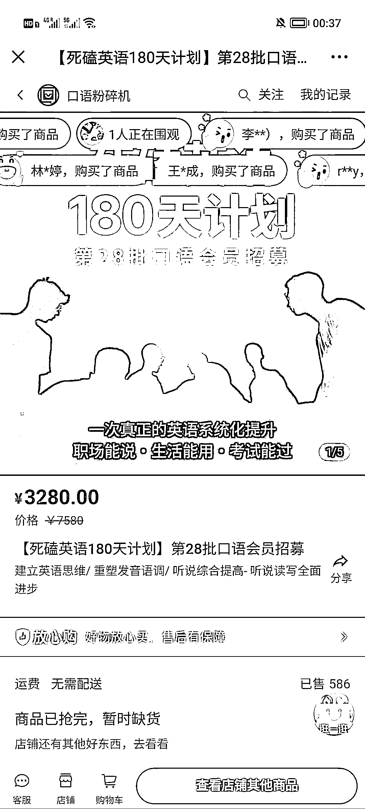

# 内容赛道的引流思路

> 原文：[`www.yuque.com/for_lazy/xkrm14/pxnml5mctkghnhw7`](https://www.yuque.com/for_lazy/xkrm14/pxnml5mctkghnhw7)

作者： 米笠

日期：2023-02-10

点赞数：24

<ne-hole id="u46fdd77c" data-lake-id="u46fdd77c"><ne-card data-card-name="hr" data-card-type="block" id="tE8b8" data-event-boundary="card">

内容赛道的引流思路 前两天看小马宋老师在学习英语 于是与喜马拉雅搜索英语听力 发现了一个内容赛道引流变现渠道 在喜马拉雅开通频道，免费教英语 包含 0 基础的内容和考试内容 然后通过内容引流到公众号 在公众号卖进阶课程 内容比喜马拉雅的免费课程更充实 转化效果非常好，已经开了将近 30 期课程了

<ne-card data-card-name="image" data-card-type="inline" id="DlfYI" data-event-boundary="card">  <ne-p id="u962578df" data-lake-id="u962578df"><ne-card data-card-name="image" data-card-type="inline" id="DsO3R" data-event-boundary="card">  <ne-p id="ufe9597c2" data-lake-id="ufe9597c2"><ne-card data-card-name="image" data-card-type="inline" id="io3n0" data-event-boundary="card">  <ne-p id="u76f79075" data-lake-id="u76f79075"><ne-card data-card-name="image" data-card-type="inline" id="WOBsh" data-event-boundary="card">  <ne-hole id="u6d7180bc" data-lake-id="u6d7180bc"><ne-card data-card-name="hr" data-card-type="block" id="LJuvd" data-event-boundary="card"><ne-p id="uda0f202a" data-lake-id="uda0f202a">公众号懒人找资源，懒人专属群分享

</ne-card></ne-hole></ne-card></ne-p></ne-card></ne-p></ne-card></ne-p></ne-card></ne-p></ne-card></ne-hole>