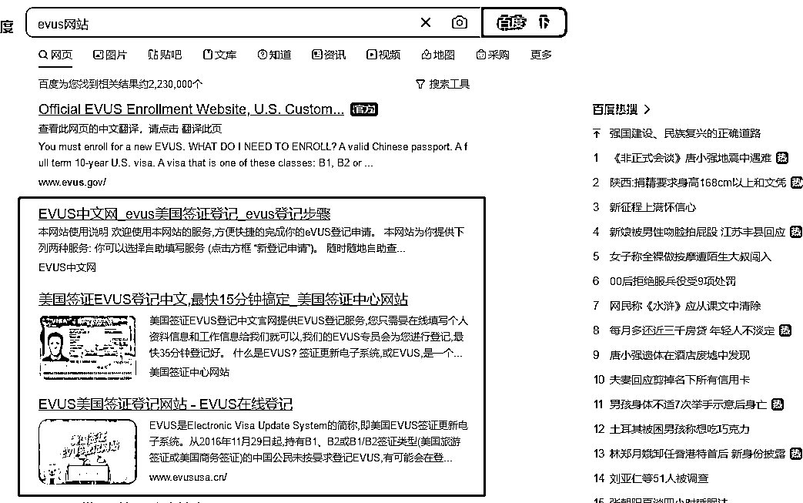

# 中英文网站信息差

> 原文：[`www.yuque.com/for_lazy/xkrm14/vuduiw2za70b6kme`](https://www.yuque.com/for_lazy/xkrm14/vuduiw2za70b6kme)

<ne-p id="u9a211247" data-lake-id="u9a211247"><ne-text id="u7d236a98">作者： 米笠</ne-text></ne-p> <ne-p id="u5fb95ba9" data-lake-id="u5fb95ba9"><ne-text id="u36c4e1bc">日期：2023-02-10</ne-text></ne-p> <ne-p id="u5d5c1007" data-lake-id="u5d5c1007"><ne-text id="udb6e95db">点赞数：</ne-text><ne-text id="u06271d49" ne-bold="true">11</ne-text></ne-p> <ne-hole id="u78a22332" data-lake-id="u78a22332"><ne-card data-card-name="hr" data-card-type="block" id="Q46vr" data-event-boundary="card"><ne-p id="u0a9f9fd4" data-lake-id="u0a9f9fd4"><ne-text id="u2b61df86">中英文网站信息差 美国签证 B 签，每两年都要进行 EVUS 登记 大使馆网站登记免费，但是是英文的 于是好几个中文网站 提供中文 evus 登记服务 需要支付费用</ne-text> <ne-text id="ude270e4f">用户提供信息、支付费用之后，后台再去大使馆网站提交，赚取信息差。 之前这个关键词也被投放了数十年，最近才改成官网排名第一，其他几个网站紧随其后。</ne-text></ne-p> <ne-p id="u2b2b80b9" data-lake-id="u2b2b80b9"><ne-card data-card-name="image" data-card-type="inline" id="XpsXM" data-event-boundary="card"></ne-card></ne-p> <ne-p id="ufd7517cd" data-lake-id="ufd7517cd"><ne-card data-card-name="image" data-card-type="inline" id="rPlNq" data-event-boundary="card"></ne-card></ne-p> <ne-hole id="u33692e2a" data-lake-id="u33692e2a"><ne-card data-card-name="hr" data-card-type="block" id="VTTt7" data-event-boundary="card"><ne-p id="uf0ce5e93" data-lake-id="uf0ce5e93"><ne-text id="u1abebb5d">公众号懒人找资源，懒人专属群分享</ne-text></ne-p></ne-card></ne-hole></ne-card></ne-hole>