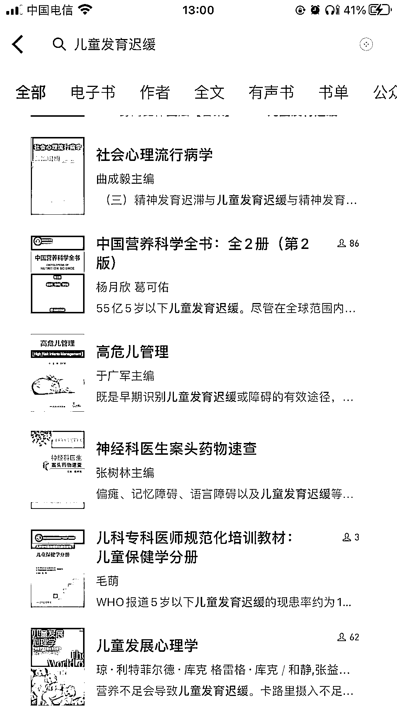

# 微信读书搜索功能非常强大，通过问题可以生成自媒体平台原创文章

> 原文：[`www.yuque.com/for_lazy/xkrm14/rg7xrhh0yq0mky69`](https://www.yuque.com/for_lazy/xkrm14/rg7xrhh0yq0mky69)

作者： 好六

日期：2023-02-06

点赞数：28

<ne-hole id="uf3126a77" data-lake-id="uf3126a77">

微信读书的搜索功能非常强大，提取问题的关键词，然后搜索，就可以找到涉及该问题的 相关书籍，而且是直接定位的相关章节。把关于这个问题的 5 条以上回答复制下来，然后就可以混剪成一篇专业全面的原创文章，已经在百度、头条、知乎平台试过了。对于视频创作者、自媒体人、知乎好物相关的人群简直是个大福利，找出的资源比百度要好很多。

  <ne-p id="ubd71d753" data-lake-id="ubd71d753">  <ne-p id="uaa98a815" data-lake-id="uaa98a815">  <ne-hole id="u3edbb9d9" data-lake-id="u3edbb9d9"><ne-p id="ud6876139" data-lake-id="ud6876139">公众号懒人找资源，懒人专属群分享

</ne-hole></ne-p></ne-p></ne-p></ne-hole>