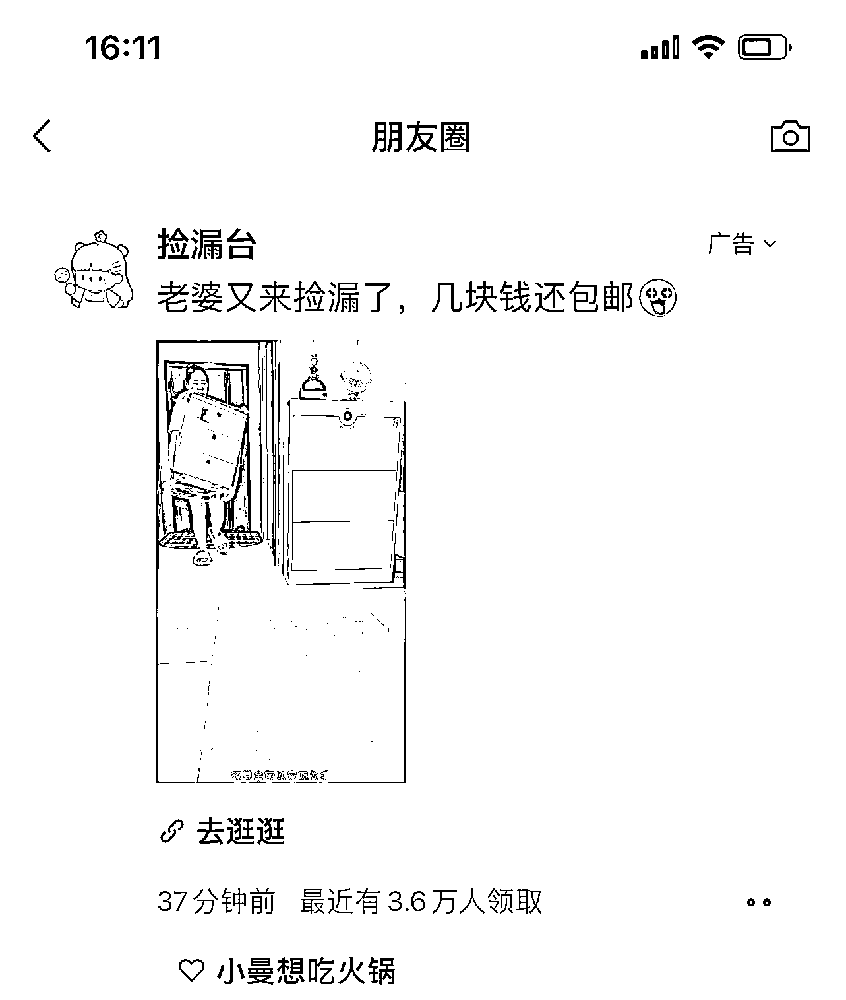

# 微信朋友圈的淘宝客投流

> 原文：[`www.yuque.com/for_lazy/xkrm14/bt0bu9umtco7845y`](https://www.yuque.com/for_lazy/xkrm14/bt0bu9umtco7845y)

<ne-p id="u5c50835f" data-lake-id="u5c50835f"><ne-text id="uf41895e1">作者： 明月几时有</ne-text></ne-p> <ne-p id="u786d5169" data-lake-id="u786d5169"><ne-text id="u935ad48f">日期：2023-02-09</ne-text></ne-p> <ne-p id="u200d3c88" data-lake-id="u200d3c88"><ne-text id="u6fe49981">点赞数：</ne-text><ne-text id="ub344301f" ne-bold="true">7</ne-text></ne-p> <ne-hole id="u56256fe5" data-lake-id="u56256fe5"><ne-card data-card-name="hr" data-card-type="block" id="oamq3" data-event-boundary="card"><ne-p id="ubd3a3f30" data-lake-id="ubd3a3f30"><ne-text id="u1a9ab1a2">微信朋友圈的淘宝客投流 看图 1 的 3.6 万人领取，就知道这件事情不是那么的简单，你要进了其中的一个微信，就会继续给你推这种广告。 能一直推，说明利润很多。</ne-text></ne-p> <ne-p id="u22ee1909" data-lake-id="u22ee1909"><ne-card data-card-name="image" data-card-type="inline" id="XtR9q" data-event-boundary="card">  <ne-p id="uacc17688" data-lake-id="uacc17688"><ne-card data-card-name="image" data-card-type="inline" id="Z3yaH" data-event-boundary="card">  <ne-p id="u3264434e" data-lake-id="u3264434e"><ne-card data-card-name="image" data-card-type="inline" id="La3pw" data-event-boundary="card">  <ne-hole id="u7699ff20" data-lake-id="u7699ff20"><ne-card data-card-name="hr" data-card-type="block" id="BzElm" data-event-boundary="card"><ne-p id="u2acc7807" data-lake-id="u2acc7807"><ne-text id="uab2f99d3">公众号懒人找资源，懒人专属群分享</ne-text></ne-p></ne-card></ne-hole></ne-card></ne-p></ne-card></ne-p></ne-card></ne-p></ne-card></ne-hole>