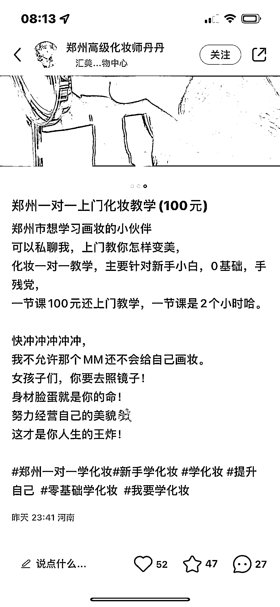
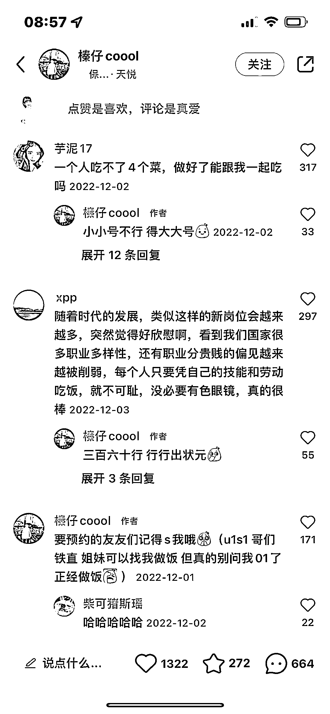
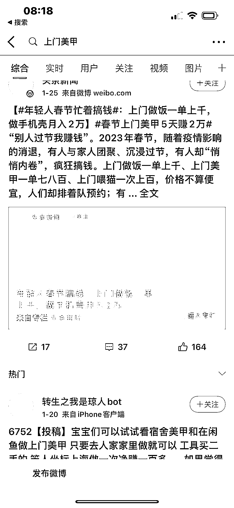
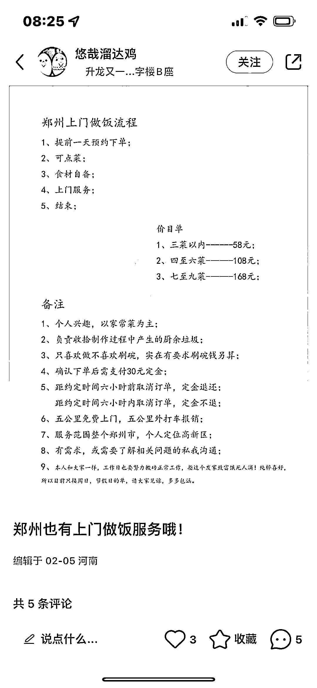

# 线下实体上门生意，满足个性化需求

> 原文：[`www.yuque.com/for_lazy/xkrm14/glze0prdp92d51kw`](https://www.yuque.com/for_lazy/xkrm14/glze0prdp92d51kw)

作者： 张义维

日期：2023-02-09

点赞数：46

上门+教化妆 人们的需求得到更好的满足，不再专门去一个地方化妆了。 延伸： 1，上门拍证件照，（你不需要去影楼排队） 2，上门理发（你不需要去理发店） 3，上门做饭（天鹅到家，还可以其他的，如下图是帅哥到家做饭，评论区全是女的，有的说做好饭能陪我一起吃吗😂） 4，上门送餐（有个公司满足了这个需求企业价值九千多亿市值，美团外卖） 5，上门整理收纳不是也很火吗，收纳师 6，上门问诊（不需要去医院） 7，上门美甲（如下图） 8，上门心理咨询师 9，上门教书法， 10，上门宠物训练， 11，上门教冥想， 12，上门教口才，演讲，表达， 上门教唱歌，舞蹈 13，上门教瑜伽， 14，我还想到， 有没有上门劝架（解决夫妻矛盾，婆媳矛盾 ）， 上门教育头疼的孩子（比如爱玩手机家长管教不听的，比如青春期叛逆父母话不听）的？哈哈😄 解决了家庭和谐，关系问题！ 多大的需求啊！ 而且有时候当局者迷，旁观者清！ 在家变美 ，变瘦，变智慧 总之……上门+一切…… 小需求 有大机会啊！ 你看郑州 uu 跑腿，一个跑腿的公司 价值：节省时间，满足人性中的懒，或者解决了私密问题，不想出去或者不能出去等的问题。 越是高频的需求，越需要被个性化的满足。满足的越舒服，用户越满意。

  <ne-p id="ud160c24c" data-lake-id="ud160c24c">  <ne-p id="uc5a26199" data-lake-id="uc5a26199">

  <ne-p id="ua7ea823a" data-lake-id="ua7ea823a">公众号懒人找资源，懒人专属群分享

</ne-p></ne-p></ne-p>