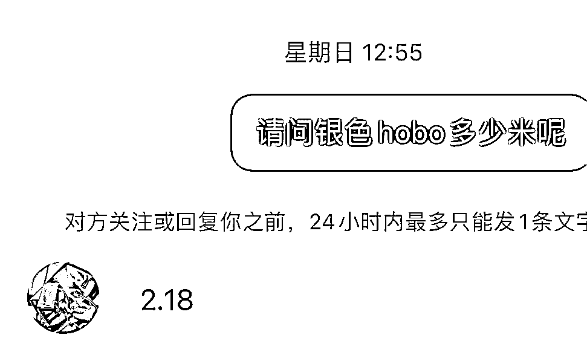

# 二奢好物无货源模式

> 原文：[`www.yuque.com/for_lazy/xkrm14/ko7cah8gb7tps630`](https://www.yuque.com/for_lazy/xkrm14/ko7cah8gb7tps630)

作者： 蓝象

日期：2023-02-08

点赞数：15

<ne-hole id="ub27b1192" data-lake-id="ub27b1192"><ne-card data-card-name="hr" data-card-type="block" id="HRy8N" data-event-boundary="card">

二奢好物无货源模式 中古和二奢爱好者可从闲鱼淘宝等添加各种二奢卖家微信和货品图，于小红书等地发布，引流微信，无脑复制粘贴发布。 虽然低频，但差价大，二奢市场并没有统一价格，信息差严重，同一款包包，差一千，注意尽量选择不同平台便可。

<ne-card data-card-name="image" data-card-type="inline" id="EPiUg" data-event-boundary="card">  <ne-p id="uae9d24b0" data-lake-id="uae9d24b0"><ne-card data-card-name="image" data-card-type="inline" id="Lj2lH" data-event-boundary="card">  <ne-hole id="ue8d02401" data-lake-id="ue8d02401"><ne-card data-card-name="hr" data-card-type="block" id="rouW5" data-event-boundary="card"><ne-p id="u7a052ed9" data-lake-id="u7a052ed9">公众号懒人找资源，懒人专属群分享

</ne-card></ne-hole></ne-card></ne-p></ne-card></ne-p></ne-card></ne-hole>