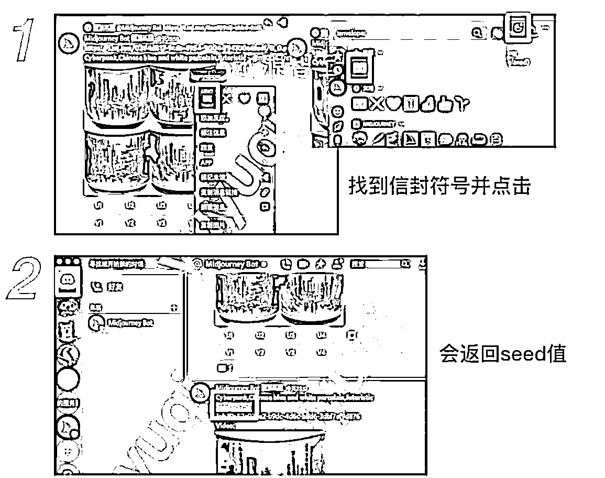
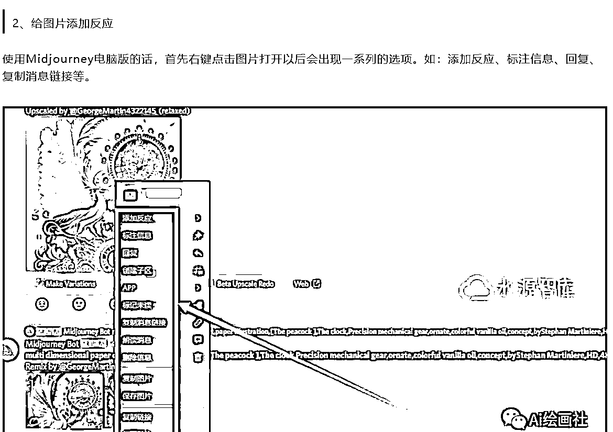

# Ai 绘画软件 Midjourney 种子值(seed)的作用和找法

> 原文：[`www.yuque.com/for_lazy/xkrm14/qgp33blng2lg8qoq`](https://www.yuque.com/for_lazy/xkrm14/qgp33blng2lg8qoq)

<ne-p id="u807dbbb2" data-lake-id="u807dbbb2"><ne-text id="u5ecaf4ee">作者： Xin _yueyu*</ne-text></ne-p> <ne-p id="ue2ad9962" data-lake-id="ue2ad9962"><ne-text id="u2aff6bc8">日期：2023-03-10</ne-text></ne-p> <ne-p id="u227378b6" data-lake-id="u227378b6"><ne-text id="ud8a6090c">点赞数：</ne-text><ne-text id="ua906292e" ne-bold="true">91</ne-text></ne-p> <ne-hole id="ua62bf4cc" data-lake-id="ua62bf4cc"><ne-card data-card-name="hr" data-card-type="block" id="k1KXM" data-event-boundary="card"><ne-p id="uf56bdfe3" data-lake-id="uf56bdfe3"><ne-text id="ua852ab18">正文：</ne-text></ne-p> <ne-p id="ueac83ceb" data-lake-id="ueac83ceb"><ne-text id="ufc6f2919">Ai 绘画软件 Midjourney 种子值(seed)的作用和找法。</ne-text> <ne-text id="u8257ee38">在 midjourney 绘画中，如果制作了一张很精美的图片，想要生成一组类似的图片，光拿到 tag 组合是不够的。影响 ai 绘画的参数有很多，seed 种子值就是其中一个，链接中介绍了 seed 的作用和找法。</ne-text>[<ne-text id="ub58d0c40">Ai 绘画软件 Midjourney 种子值(seed)的作用和找法。+–+水源智库</ne-text>](https://www.281050.com/246248.html)</ne-p> <ne-p id="ubf54cd05" data-lake-id="ubf54cd05"><ne-card data-card-name="image" data-card-type="inline" id="KluuA" data-event-boundary="card"></ne-card></ne-p> <ne-p id="u11123329" data-lake-id="u11123329"><ne-card data-card-name="image" data-card-type="inline" id="wgUva" data-event-boundary="card"></ne-card></ne-p> <ne-p id="u1470e3cd" data-lake-id="u1470e3cd"><ne-card data-card-name="image" data-card-type="inline" id="Yvo7m" data-event-boundary="card"></ne-card></ne-p> <ne-hole id="ub8dd5908" data-lake-id="ub8dd5908"><ne-card data-card-name="hr" data-card-type="block" id="NCVUd" data-event-boundary="card"><ne-p id="uf29e4ef4" data-lake-id="uf29e4ef4"><ne-text id="uebbbf013">评论区：</ne-text></ne-p> <ne-p id="u81f603d2" data-lake-id="u81f603d2"><ne-text id="ucf4f1189">冯冯 FOX : 已实践，非常有用感谢</ne-text></ne-p> <ne-p id="u9d54c04f" data-lake-id="u9d54c04f"><ne-text id="u97ebbcf8">橙 Sir : 变现： - 可以针对某个垂类，收集相关的种子值，生产精美的图片 - 建立种子值的网站，并定期更新，收订阅费（准备实践一下）</ne-text></ne-p> <ne-p id="u30a94a2d" data-lake-id="u30a94a2d"><ne-text id="ua4802b4f">Xin _yueyu* : 橙 sir 会做网站吗 我确实没想到这一点 也不会做😅</ne-text></ne-p> <ne-p id="ue2644a18" data-lake-id="ue2644a18"><ne-text id="u9dc8bc72">橙 Sir : 会啊</ne-text></ne-p> <ne-hole id="u73205829" data-lake-id="u73205829"><ne-card data-card-name="hr" data-card-type="block" id="PtR3U" data-event-boundary="card"><ne-p id="u8d11b03c" data-lake-id="u8d11b03c"><ne-text id="u4f33782a">公众号懒人找资源，懒人专属群分享</ne-text></ne-p></ne-card></ne-hole></ne-card></ne-hole></ne-card></ne-hole>