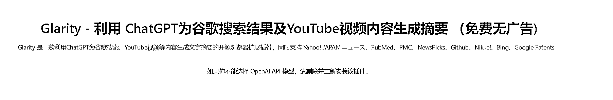

# 使用 chatgpt 对 youtube 的字幕总结工具

> 原文：[`www.yuque.com/for_lazy/xkrm14/gsrlazgflkgcl9le`](https://www.yuque.com/for_lazy/xkrm14/gsrlazgflkgcl9le)

作者： shine_fore* 

日期：2023-03-10 

点赞数：70 

正文： 

一款针使用 chatgpt 对 youtube 的字幕总结工具 最近突然发现对好多视频网站，大家都有这类似的需求； 然后我搜索了下“summary”这个关键词，发现 Tactiq: ChatGPT meeting summary 这款产品已经 200,000+ 位用户！而且该产品已经开始收费了，商业模式已经跑通，而且还是精选应用！[呲牙] 

  

  

  

评论区： 

波叔 : 这就是刚需呀 

新世界 : 这是给没时间的人节省看视频总结的时间吗 

shine_fore* : 嗯 看了大纲再看适不适合自己吧。 

三林 : 应该是改名，蹭 ChatGPT 的关键词 

shine_fore* : chrome 插件仓库里面，副标题加了 chatgpt 这个热词 

