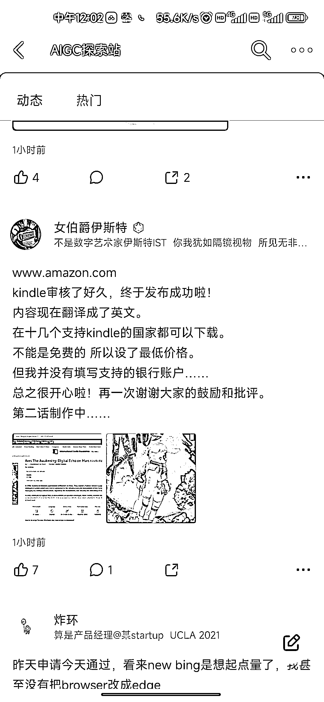

# 用 chatGPT 翻译书籍，并在亚马逊售卖

> 原文：[`www.yuque.com/for_lazy/xkrm14/pcb4476z4wgp7go2`](https://www.yuque.com/for_lazy/xkrm14/pcb4476z4wgp7go2)

<ne-p id="u6821a102" data-lake-id="u6821a102"><ne-text id="u1c422175">作者： 海迪</ne-text></ne-p> <ne-p id="ubf0e0b8f" data-lake-id="ubf0e0b8f"><ne-text id="u959953ac">日期：2023-03-10</ne-text></ne-p> <ne-p id="u14a2f506" data-lake-id="u14a2f506"><ne-text id="u3204e759">点赞数：</ne-text><ne-text id="ue33fbfa0" ne-bold="true">54</ne-text></ne-p> <ne-hole id="u8e2a0253" data-lake-id="u8e2a0253"><ne-card data-card-name="hr" data-card-type="block" id="H8fU0" data-event-boundary="card"><ne-p id="u99393528" data-lake-id="u99393528"><ne-text id="u05df3ce2">正文：</ne-text></ne-p> <ne-p id="ude2db7b6" data-lake-id="ude2db7b6"><ne-text id="uadd8b868">已经有人用 chatGPT 翻译书籍，并在亚马逊售卖。</ne-text></ne-p> <ne-p id="udcf19577" data-lake-id="udcf19577"><ne-card data-card-name="image" data-card-type="inline" id="mElOt" data-event-boundary="card">  <ne-p id="u09b1290e" data-lake-id="u09b1290e"><ne-card data-card-name="image" data-card-type="inline" id="qxH5c" data-event-boundary="card">  <ne-hole id="u237e4c72" data-lake-id="u237e4c72"><ne-card data-card-name="hr" data-card-type="block" id="tqArl" data-event-boundary="card"><ne-p id="u29373691" data-lake-id="u29373691"><ne-text id="u71794093">评论区：</ne-text></ne-p> <ne-p id="u7643d74d" data-lake-id="u7643d74d"><ne-text id="u7f1444a8">茜茜 : 这个会有版权问题吗？</ne-text></ne-p> <ne-p id="u9330dc7c" data-lake-id="u9330dc7c"><ne-text id="u69271c26">海迪 : 应该有，但是那种已故超过 50 年的作者的书，就没有</ne-text></ne-p> <ne-p id="u075030ca" data-lake-id="u075030ca"><ne-text id="u7626e52e">波叔 : 是不是还可以做成视频呢？</ne-text></ne-p> <ne-hole id="u9a4ece53" data-lake-id="u9a4ece53"><ne-card data-card-name="hr" data-card-type="block" id="KMa7n" data-event-boundary="card"><ne-p id="u3b0774b4" data-lake-id="u3b0774b4"><ne-text id="u3dfb8c9c">公众号懒人找资源，懒人专属群分享</ne-text></ne-p></ne-card></ne-hole></ne-card></ne-hole></ne-card></ne-p></ne-card></ne-p></ne-card></ne-hole>