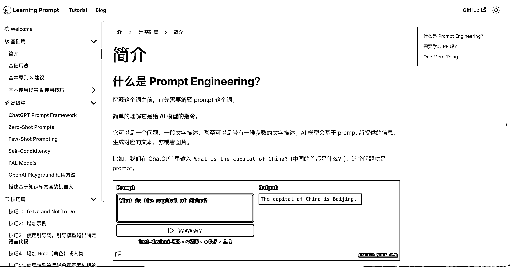

# 免费的 Prompt Engineering 中文教程

> 原文：[`www.yuque.com/for_lazy/xkrm14/bovvt5s2e2fc2ylq`](https://www.yuque.com/for_lazy/xkrm14/bovvt5s2e2fc2ylq)

<ne-p id="uc2b24e9d" data-lake-id="uc2b24e9d"><ne-text id="u88200f89">作者： Mr.Zhang</ne-text></ne-p> <ne-p id="ufb06f79c" data-lake-id="ufb06f79c"><ne-text id="u7fb2b929">日期：2023-03-09</ne-text></ne-p> <ne-p id="u163c2f68" data-lake-id="u163c2f68"><ne-text id="u50f867c0">点赞数：</ne-text><ne-text id="uc1c20783" ne-bold="true">35</ne-text></ne-p> <ne-hole id="u91655420" data-lake-id="u91655420"><ne-card data-card-name="hr" data-card-type="block" id="kTedh" data-event-boundary="card"><ne-p id="ub887de9d" data-lake-id="ub887de9d"><ne-text id="u9b6dc874">正文：</ne-text></ne-p> <ne-p id="ua1bf6957" data-lake-id="ua1bf6957"><ne-text id="u44dd822a">一份免费的 Prompt Engineering 中文教程 如果你不知道能拿 ChatGPT 或者其他 AI 产品来干什么； 如果你不知道如何更好地使用</ne-text> <ne-text id="u031e47be">OpenAI 提供的 API； 那本教程应该能帮到你。</ne-text> [<ne-text id="ue083a7ae">Hello+from+Learning+Prompt+|+Learning+Prompt</ne-text>](https://learningprompt.wiki/)</ne-p> <ne-p id="u4ff8caeb" data-lake-id="u4ff8caeb"><ne-card data-card-name="image" data-card-type="inline" id="ONIZ3" data-event-boundary="card">  <ne-hole id="u1c78df44" data-lake-id="u1c78df44"><ne-card data-card-name="hr" data-card-type="block" id="PIOhc" data-event-boundary="card"><ne-p id="uecbb0392" data-lake-id="uecbb0392"><ne-text id="ud417f814">评论区：</ne-text></ne-p> <ne-p id="u1f2cc01f" data-lake-id="u1f2cc01f"><ne-text id="ue192e3b8">暂无评论</ne-text></ne-p> <ne-hole id="ubb945a48" data-lake-id="ubb945a48"><ne-card data-card-name="hr" data-card-type="block" id="p9ti1" data-event-boundary="card"><ne-p id="ua83df81e" data-lake-id="ua83df81e"><ne-text id="u4353cf31">公众号懒人找资源，懒人专属群分享</ne-text></ne-p></ne-card></ne-hole></ne-card></ne-hole></ne-card></ne-p></ne-card></ne-hole>