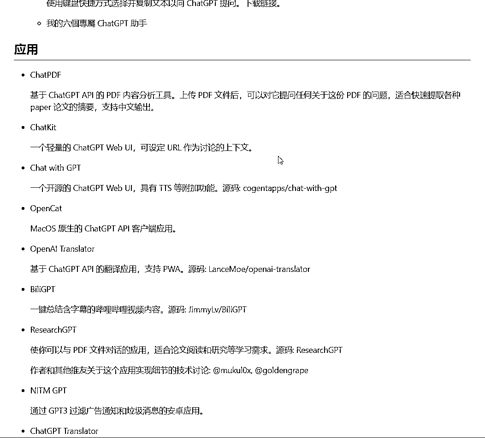

# 丰富的 ChatGPT 资料库

> 原文：[`www.yuque.com/for_lazy/xkrm14/rg7dwz9oiv0g6lnp`](https://www.yuque.com/for_lazy/xkrm14/rg7dwz9oiv0g6lnp)

作者： 常常 

日期：2023-03-08 

点赞数：34 

正文： 

分享一个 丰富的 ChatGPT 资料库： 这里有近百个，基于 ChatGPT API，且允许配置自己的 API key 的工具和应用的精选列表。 插件、扩展，应用、CLI、聊天机器人、开源项目、工具和技术文章。 可以把这里当做是一个小型的 AI 项目库列表。 awesome-chatgpt- api/README.cn.md+at+master+·+reorx... chatgpt-api/blob/master/README.cn.md) 

  

  

评论区： 

一米七大个 : 原地址失效了，这个是新的 [awesome-chatgpt-api/README.cn.md+at+master+·+reorx...](https://github.com/reorx/awesome-chatgpt-api/blob/master/README.cn.md) 

常常 : 感谢，感谢补充[机智] 

