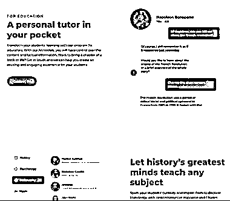
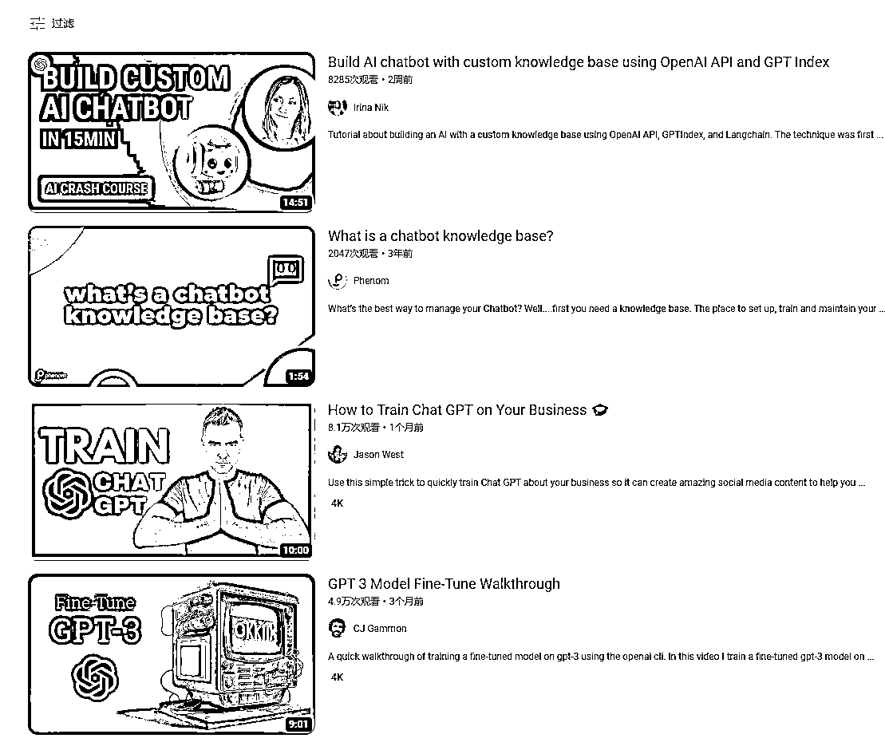

# 用 ChatGPT 定制榜样，向榜样学习和提问

> 原文：[`www.yuque.com/for_lazy/xkrm14/cghoszzeoncn7eg6`](https://www.yuque.com/for_lazy/xkrm14/cghoszzeoncn7eg6)

作者： 橙 Sir 

日期：2023-03-08 

点赞数：26 

正文： 

用 ChatGPT 定制一个自己想学习的人（向榜样学习和提问），或是想学习的业务 【案例 1】与历史人物聊天： 【案例 2】定制 Paul-Graham： 自己想做的话，也有 step by step 的教程，youtube 搜：Chatbot with custom knowledge base 即可 [Hello+History+-+Chat+with+AI+Generated+Historical+...](https://www.hellohistory.ai/) [[https://paul-graham-gpt.vercel.app/](https://paul-graham-gpt.vercel.app/)](https://paul-graham- gpt.vercel.app/)[https://colab.research.google.com/drive/1PQXcM_jhN...](https://colab.research.google.com/drive/1PQXcM_jhN6QJ7uTkxvNbxoI54r03uSr3?usp=sharing#scrollTo=XiUyHP4T2g5F) 

  

 

评论区： 

暂无评论 

