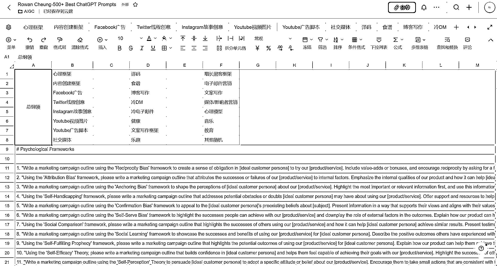

# chatGPT 的提示和商业应用

> 原文：[`www.yuque.com/for_lazy/xkrm14/nrtdqivrqq9bw38f`](https://www.yuque.com/for_lazy/xkrm14/nrtdqivrqq9bw38f)

作者： 卡夫 

日期：2023-03-07 

点赞数：37 

正文： 

根据标叔之前的风向标，顺着信息找到了 chatGPT 的提示和商业应用。自己导在了飞书《500+chatGPT 提示》英文版，飞书可以直接翻译、《200 个 chatGPT 创意》（没弄完，不过也够看了）。飞书地址： [https://xqbdv3j9k0.feishu.cn/sheets/shtcneMaiMxfJP...](https://xqbdv3j9k0.feishu.cn/sheets/shtcneMaiMxfJPmQnjhe9BigcXk) [https://xqbdv3j9k0.feishu.cn/sheets/shtcnt2P4c9SsS...](https://xqbdv3j9k0.feishu.cn/sheets/shtcnt2P4c9SsSUCVDOY2YDkm4b) 

  

评论区： 

Allan : 好棒呀！ 

唐瑞 : 厉害啊！ 

无忌三旬 : 怎么导的？爬虫？ 

卡夫 : 哈哈哈哈 谢谢 

卡夫 : 不厉害不厉害还要继续学习 

卡夫 : 我复制粘贴的，应该可以让机器人帮忙干 但是我不会😂 

无忌三旬 : 厉害👍结果拿到就行 

卡夫 : 拿了个好用的工具 

