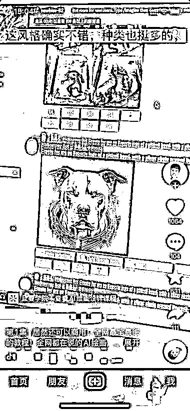
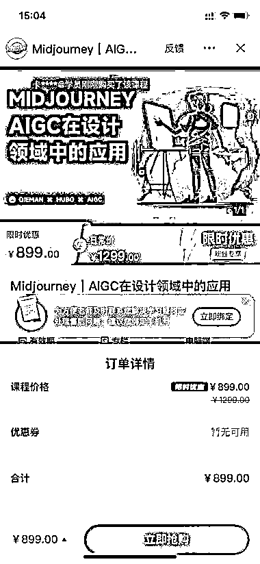

# 打包 AI 绘画教程，挂抖音小程序变现。

> 原文：[`www.yuque.com/for_lazy/xkrm14/gtqqdo67vlkgsl7f`](https://www.yuque.com/for_lazy/xkrm14/gtqqdo67vlkgsl7f)

<ne-p id="u9169ab30" data-lake-id="u9169ab30"><ne-text id="u82898269">作者： 北辰</ne-text></ne-p> <ne-p id="u2730d81d" data-lake-id="u2730d81d"><ne-text id="u1eda6f5f">日期：2023-03-06</ne-text></ne-p> <ne-p id="ua5ea5ad7" data-lake-id="ua5ea5ad7"><ne-text id="u28c9bf7d">点赞数：</ne-text><ne-text id="ud195c9f6" ne-bold="true">24</ne-text></ne-p> <ne-hole id="u6117dcb9" data-lake-id="u6117dcb9"><ne-card data-card-name="hr" data-card-type="block" id="d0Kd2" data-event-boundary="card"><ne-p id="u552ff621" data-lake-id="u552ff621"><ne-text id="u85fcfa8b">正文：</ne-text></ne-p> <ne-p id="ud9e30adb" data-lake-id="ud9e30adb"><ne-text id="uacdec02a">打包 AI 绘画教程，挂抖音小程序变现。 课程价格 899，已有 155 人学习。</ne-text></ne-p> <ne-p id="u30b84418" data-lake-id="u30b84418"><ne-card data-card-name="image" data-card-type="inline" id="Svdpb" data-event-boundary="card">  <ne-p id="u2dd7e218" data-lake-id="u2dd7e218"><ne-card data-card-name="image" data-card-type="inline" id="cVQjv" data-event-boundary="card">  <ne-hole id="u2ba1e0b5" data-lake-id="u2ba1e0b5"><ne-card data-card-name="hr" data-card-type="block" id="SqxKJ" data-event-boundary="card"><ne-p id="ub1d5d473" data-lake-id="ub1d5d473"><ne-text id="u1068769d">评论区：</ne-text></ne-p> <ne-p id="u10afb41a" data-lake-id="u10afb41a"><ne-text id="uaf425ec7">暂无评论</ne-text></ne-p> <ne-hole id="uf980a574" data-lake-id="uf980a574"><ne-card data-card-name="hr" data-card-type="block" id="IF65i" data-event-boundary="card"><ne-p id="u364617c6" data-lake-id="u364617c6"><ne-text id="u625efbe8">公众号懒人找资源，懒人专属群分享</ne-text></ne-p></ne-card></ne-hole></ne-card></ne-hole></ne-card></ne-p></ne-card></ne-p></ne-card></ne-hole>