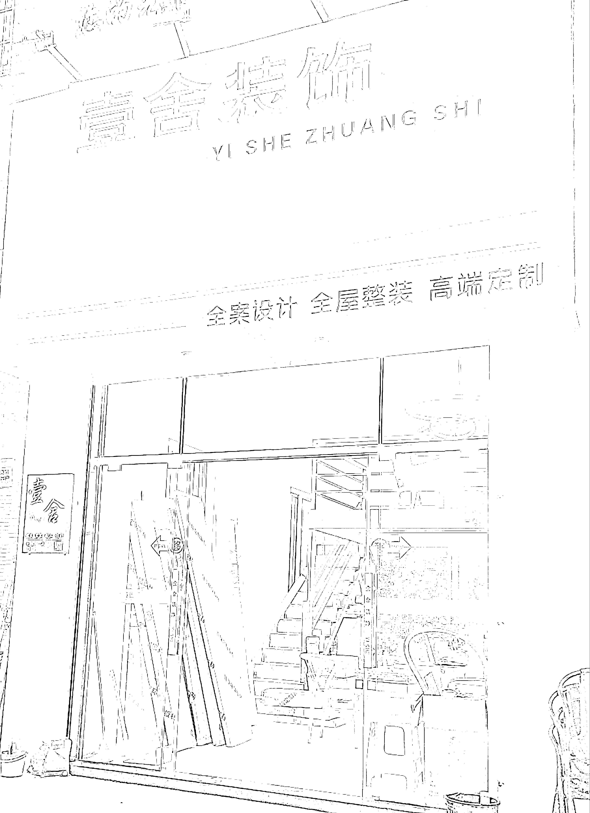

# 腰部装修公司，可以在抖音矩阵化操作，获取本地流量

> 原文：[`www.yuque.com/for_lazy/xkrm14/lkdzdvtnusimx3bg`](https://www.yuque.com/for_lazy/xkrm14/lkdzdvtnusimx3bg)

<ne-p id="ue21e55dc" data-lake-id="ue21e55dc"><ne-text id="u5862e65c">作者： 楚川</ne-text></ne-p> <ne-p id="ua7de1b05" data-lake-id="ua7de1b05"><ne-text id="u763aefd3">日期：2023-03-10</ne-text></ne-p> <ne-p id="ue9a5d320" data-lake-id="ue9a5d320"><ne-text id="ua38fab01">点赞数：</ne-text><ne-text id="ua1bfa3b5" ne-bold="true">47</ne-text></ne-p> <ne-hole id="ucf306703" data-lake-id="ucf306703"><ne-card data-card-name="hr" data-card-type="block" id="N8v1s" data-event-boundary="card"><ne-p id="u658cfa0b" data-lake-id="u658cfa0b"><ne-text id="u42c9b7b0">正文：</ne-text></ne-p> <ne-p id="u14eb365b" data-lake-id="u14eb365b"><ne-text id="u765fc823">经过一个月的了解，各区域装修设计公司的客户线索是溢出的，流量足够多。反倒是腰尾部的公司急需流量，图片中这么大小的装修设计公司，一个城市云连锁 5 家，200 个地级市就是 1000 家。矩阵打下去，可以在抖音偷走头部品牌的大部分流量（本地生活版块）。</ne-text></ne-p> <ne-p id="u5fdc30ce" data-lake-id="u5fdc30ce"><ne-card data-card-name="image" data-card-type="inline" id="hjit0" data-event-boundary="card"></ne-card></ne-p> <ne-hole id="ueb3aec10" data-lake-id="ueb3aec10"><ne-card data-card-name="hr" data-card-type="block" id="rCzSn" data-event-boundary="card"><ne-p id="u33994db3" data-lake-id="u33994db3"><ne-text id="ub54571e4">评论区：</ne-text></ne-p> <ne-p id="u0bd6a812" data-lake-id="u0bd6a812"><ne-text id="u82896e2e">暂无评论</ne-text></ne-p> <ne-hole id="u09ee2c70" data-lake-id="u09ee2c70"><ne-card data-card-name="hr" data-card-type="block" id="zt8Rd" data-event-boundary="card"><ne-p id="u54457e15" data-lake-id="u54457e15"><ne-text id="ub193e464">公众号懒人找资源，懒人专属群分享</ne-text></ne-p></ne-card></ne-hole></ne-card></ne-hole></ne-card></ne-hole>