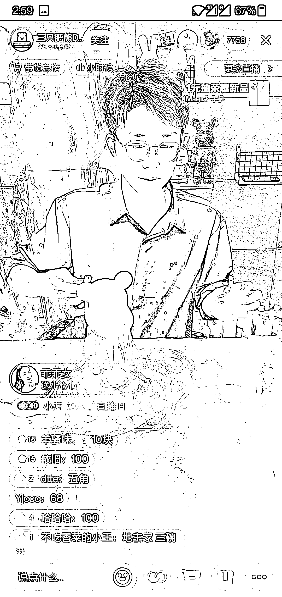
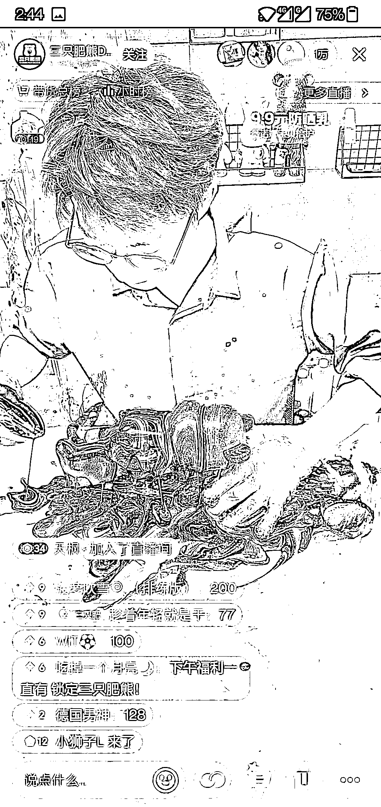
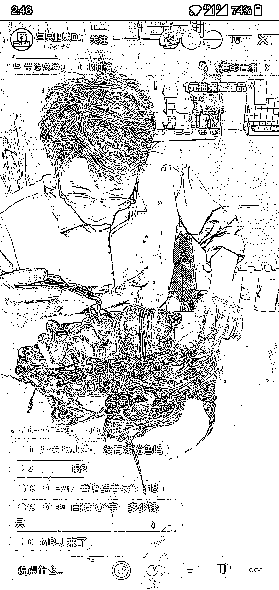

# 抖音流体熊直播间，直播制作过程，竞价拍卖

> 原文：[`www.yuque.com/for_lazy/xkrm14/dltkgroihdqm9gwf`](https://www.yuque.com/for_lazy/xkrm14/dltkgroihdqm9gwf)

<ne-p id="u4d2c1ef1" data-lake-id="u4d2c1ef1"><ne-text id="u3c9b06e1">作者： 范澈澈</ne-text></ne-p> <ne-p id="ud52eaa04" data-lake-id="ud52eaa04"><ne-text id="ud2d19f9e">日期：2023-03-10</ne-text></ne-p> <ne-p id="u6e14c236" data-lake-id="u6e14c236"><ne-text id="uc4295ad9">点赞数：</ne-text><ne-text id="ufd72ff08" ne-bold="true">53</ne-text></ne-p> <ne-hole id="u4606cb30" data-lake-id="u4606cb30"><ne-card data-card-name="hr" data-card-type="block" id="IEJoe" data-event-boundary="card"><ne-p id="ub4f3e826" data-lake-id="ub4f3e826"><ne-text id="u7516c87e">正文：</ne-text></ne-p> <ne-p id="u101eb53f" data-lake-id="u101eb53f"><ne-text id="udb410885">直播 DIY 调色，给模型熊上色，拍卖成品熊，看起来挺解压。调色师直播间现场调色，主持人解说互动，调完色现场上色，评论区 10 秒内出价竞拍（需要卡灯牌加入粉丝团），价高者得，封顶 128 元，看了十几分钟，巅峰在线 1W 人，大概 3 分钟一只成品熊。关于成交：有拍手在引导竞拍，基本成交价格在 90~120 元</ne-text></ne-p> <ne-p id="u3d7c9aa8" data-lake-id="u3d7c9aa8"><ne-card data-card-name="image" data-card-type="inline" id="tkDGw" data-event-boundary="card"></ne-card></ne-p> <ne-p id="ue7bdfc8e" data-lake-id="ue7bdfc8e"><ne-card data-card-name="image" data-card-type="inline" id="v6IOu" data-event-boundary="card"></ne-card></ne-p> <ne-p id="u6086eb3a" data-lake-id="u6086eb3a"><ne-card data-card-name="image" data-card-type="inline" id="J0QW9" data-event-boundary="card"></ne-card></ne-p> <ne-p id="u45dbdca1" data-lake-id="u45dbdca1"><ne-card data-card-name="image" data-card-type="inline" id="nsKz6" data-event-boundary="card"></ne-card></ne-p> <ne-hole id="u76db6d11" data-lake-id="u76db6d11"><ne-card data-card-name="hr" data-card-type="block" id="JpHOF" data-event-boundary="card"><ne-p id="u7ff39ac6" data-lake-id="u7ff39ac6"><ne-text id="ubd1e235e">评论区：</ne-text></ne-p> <ne-p id="ub2ce2391" data-lake-id="ub2ce2391"><ne-text id="ua070072f">赵晨 : 这个去年都有了</ne-text></ne-p> <ne-p id="ubc932cfd" data-lake-id="ubc932cfd"><ne-text id="u72be90cf">波叔 : 这种模式还挺不错的，现做现卖</ne-text></ne-p> <ne-p id="ubdb74da7" data-lake-id="ubdb74da7"><ne-text id="uf74fb9c5">💪🏻吉吉积极向上 : 直播画画，做手工是不是也可以</ne-text></ne-p> <ne-p id="u8fe30739" data-lake-id="u8fe30739"><ne-text id="u8aa5cb29">詹伟平 : 各个商场都有这种涂鸦</ne-text></ne-p> <ne-hole id="u9804764d" data-lake-id="u9804764d"><ne-card data-card-name="hr" data-card-type="block" id="Kwx9g" data-event-boundary="card"><ne-p id="u39a111ba" data-lake-id="u39a111ba"><ne-text id="u8591770c">公众号懒人找资源，懒人专属群分享</ne-text></ne-p></ne-card></ne-hole></ne-card></ne-hole></ne-card></ne-hole>