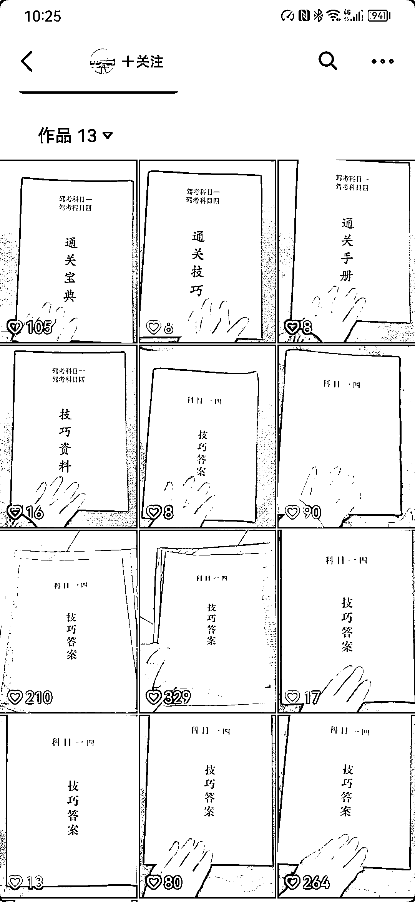
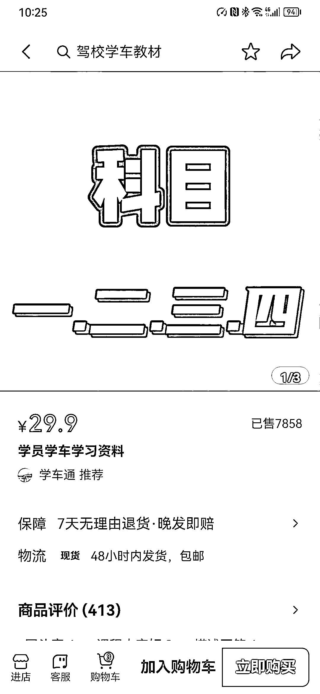
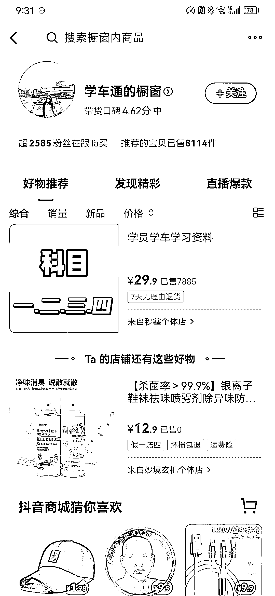

# 抖音卖驾考科一资料，同一种视频频繁发，卖 7000 份

> 原文：[`www.yuque.com/for_lazy/xkrm14/vdmhgebs1mdfgus1`](https://www.yuque.com/for_lazy/xkrm14/vdmhgebs1mdfgus1)

作者： 鱼 

日期：2023-03-09 

点赞数：110 

正文： 

抖音卖资料，2 月份开始发，一共 13 个视频，内容都是相同的，翻书看资料，一个月卖了七千多份资料 

 

  

  

评论区： 

黄承德 : 这 7000 多份不是他一个人卖的吧 

鱼 : 他自己开的店 自己带货 目前没有看到其他分销视频 

王大诗 : 别的资料不知道，但是科一还真有可能[呲牙] 

鱼 : 大佬拆解一下！不是都有手机 APP 刷题吗 为啥还有这么大的纸质资料需求 

在路上 : 中国人多 总有需求 

当下， : 这个点赞率有这么高的转化吗？ 

张丫丫 : 他的店跟视频不是一个抖音号 

鱼 : 补充了一张账号橱窗的截图 带了八千多份 

