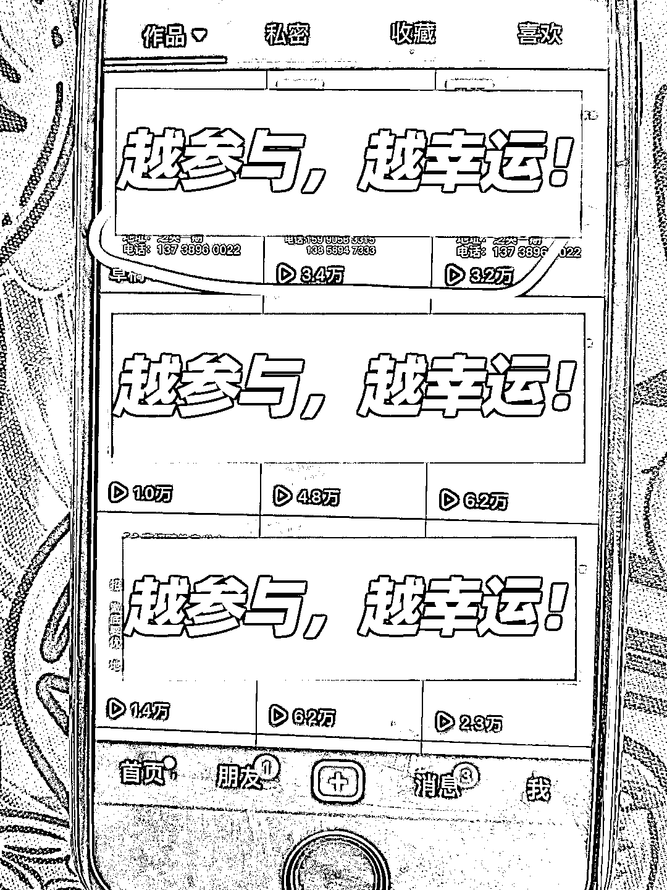

# 抖音同城招聘，可以直接在作品加联系方式引流

> 原文：[`www.yuque.com/for_lazy/xkrm14/knbwn2og5ce9k2ys`](https://www.yuque.com/for_lazy/xkrm14/knbwn2og5ce9k2ys)

<ne-p id="u37d93f94" data-lake-id="u37d93f94"><ne-text id="ud4711c73">作者： 山哥</ne-text></ne-p> <ne-p id="u95d23d26" data-lake-id="u95d23d26"><ne-text id="u67834057">日期：2023-03-09</ne-text></ne-p> <ne-p id="u20d103b8" data-lake-id="u20d103b8"><ne-text id="ue4308886">点赞数：</ne-text><ne-text id="ua9d5245f" ne-bold="true">31</ne-text></ne-p> <ne-hole id="ub8bfb924" data-lake-id="ub8bfb924"><ne-card data-card-name="hr" data-card-type="block" id="HenQv" data-event-boundary="card"><ne-p id="u3e87b9a7" data-lake-id="u3e87b9a7"><ne-text id="u9d03f459">正文：</ne-text></ne-p> <ne-p id="u88d8cb1f" data-lake-id="u88d8cb1f"><ne-text id="u9685c552">私域流量 </ne-text> <ne-text id="ua8c8be6d">实操，做同城的朋友可以参考一下，抖音同城招聘，厂房出租帐号批量打法，直接在作品上加联系方式，只要没人投诉，基本上不会违规，我们这边是认证蓝 V 或半蓝 V，有两个帐号已经跑到 9000 粉丝了，关键词优化一下，可以做到同城霸屏。</ne-text></ne-p> <ne-p id="u025cbd28" data-lake-id="u025cbd28"><ne-card data-card-name="image" data-card-type="inline" id="ofZG4" data-event-boundary="card">  <ne-hole id="ufb1e4918" data-lake-id="ufb1e4918"><ne-card data-card-name="hr" data-card-type="block" id="H8zVl" data-event-boundary="card"><ne-p id="ubcd16c5b" data-lake-id="ubcd16c5b"><ne-text id="u3691140d">评论区：</ne-text></ne-p> <ne-p id="u10aef310" data-lake-id="u10aef310"><ne-text id="u95b9153e">欢喜爸爸 : 如何操作</ne-text></ne-p> <ne-p id="ud7df35d6" data-lake-id="ud7df35d6"><ne-text id="u9dc0a041">山哥 : 简单粗暴，直接在图片加文字需求，加上联系方式</ne-text></ne-p> <ne-p id="u46801d9c" data-lake-id="u46801d9c"><ne-text id="u67c145ac">骏马 : 什么账号可否参考下</ne-text></ne-p> <ne-p id="u82b4861e" data-lake-id="u82b4861e"><ne-text id="u4040c9fc">山哥 : 搜索同城关键词，有很多这样的帐号</ne-text></ne-p> <ne-hole id="u94426d92" data-lake-id="u94426d92"><ne-card data-card-name="hr" data-card-type="block" id="qEqey" data-event-boundary="card"><ne-p id="uc923ea20" data-lake-id="uc923ea20"><ne-text id="ub23a3069">公众号懒人找资源，懒人专属群分享</ne-text></ne-p></ne-card></ne-hole></ne-card></ne-hole></ne-card></ne-p></ne-card></ne-hole>